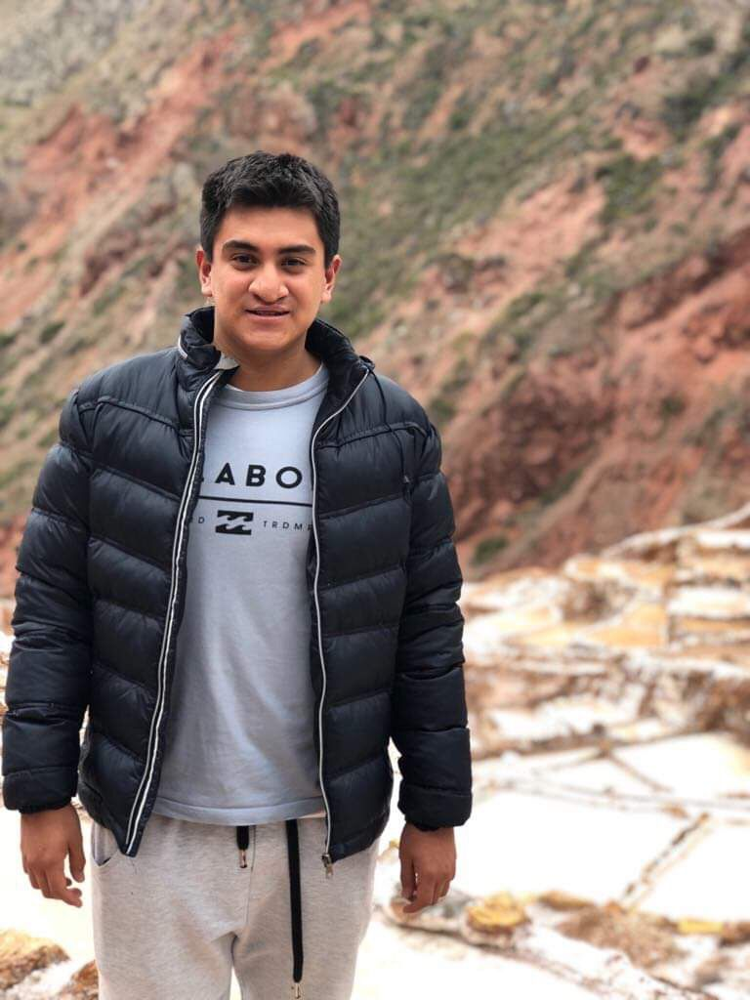

# ¿Quienes somos?

## Jorge Guillemo Chavez Echajaya
Alumno de 9no ciclo de la carrera de Ingeniería Biomédica PUCP-UPCH. Mi área de interes es la ingeniería biomecanica y el desarrollo de tecnologias en realdad virtual.

Contacto: jorge.chaveze@upch.pe

## Alejandra Valeria Chavez Yaranga
Alumno de 9no ciclo de la carrera de Ingeniería Biomédica PUCP-UPCH. Mi área de interés es la ingeniería biomecánica y el desarrollo de tecnologías en realidad virtual.

Contacto: [alejandra.chavez@upch.pe](mailto:alejandra.chavez@upch.pe)

## Diana Isabel Cortez López
Completen

Contacto: diana.cortez@upch.pe

## Joaquín Miguel Díaz Lara
Completen

Contacto: joaquin.diaz.l@upch.pe

## Rodrigo Italo Llachua Inocente  
Completen

Contacto: rodrigo.llachua@upch.pe

