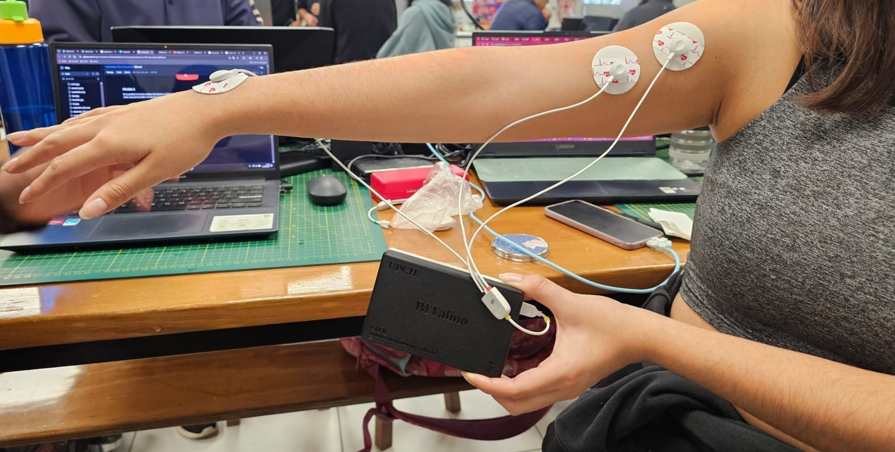

# **LABORATORIO 4: – USO DE BITalino PARA EMG**
# **Tabla de contenidos**

1. [Introducción](#id1)
2. [Objetivos](#id2)
3. [Materiales y equipos](#id3)
4. [Resultados](#id4)\
   4.1 [Conexión usada](#id5)\
   4.2 [Prueba 1: Bícep braquial](#id6)\
   4.3 [Prueba 2: Músculo aductor del pulgar](#id7)\
   4.4 [Prueba 3: Músculo gastrocnemio](#id8)\
   4.5 [Prueba 4: Tricep braquial](#id9)\
   4.6 [Archivos utilizados](#id10)
6. [Conclusiones y recomendaciones](#id11)
6. [Referencias bibliográficas](#id12)

## **Introducción** 
La señal electromiográficas (EMG) es una representación del campo de potencial eléctrico generado por la despolarización de la membrana externa de la fibra muscular (sarcolema). La señal EMG es generada por la actividad eléctrica de las fibras musculares durante una contracción. Las fuentes de la señal son las zonas de despolarización y repolarización de las fibras musculares [1]. El rango de amplitud de la señal EMG es de 0 a 10 mV (+5 a -5) antes de la amplificación [2]. La señal EMG tiene muchas aplicaciones en dispositivos de rehabilitación o prostéticos, ciencias del deporte y neurofisiología [3].

Para detectar esta señal se utilizan:
- **Electrodos intrsmusculares o de aguja**: método invasivo donde un electrodo de aguja se introduce directamente en el músculo. La inserción directa en el músculo permite la detección de potenciales eléctricos muy cerca de la fuente. Es un método más preciso y menos susceptible a interferencias.  
- **Electrodos superficiales (sEMG)**: método no invasivo donde se colocan electrodos de superfice sobre la piel, directamente en los músculos que se desea estudiar. Es un método fácil de realizar; sin embargo, es limitante solo a músculos superficiales y puede ser generar interferencias con la piel, músculos adyacentes o ruido eléctrico.

**Concepto de potencial de acción de la unidad motora (MUAP) en sEMG [3]**
La distribución de voltaje del sEMG en la piel corresponde a la suma de los potenciales de acción de las unidades motoras (MUAP) que se generan por las MU (unidad motora) activadas. Las MU representan la unidad básica del músculo, compuesta por una neurona motora y todas las fibras musculares que esta inerva. Cuando un potencial de acción axonal alcanza la unión neuromuscular, se libera acetilcolina, lo que desencadena un potencial de acción en las fibras musculares. En este sentido, cada MUAP es la suma de potenciales de acción superficiales producidos por la fibras individuales de cada unidad motor (MU) y el sEMG es la suma de estos MUAP.

 Figura 1: Representación esquemática de las fibras de dos unidades motoras [3]</i>

En el presente laboratorio, se utilizará la plataforma BITalino para poder **adquirir señal de EMG mediante electrodos de superficie (sEMG) de 4 músculos distintos: bícep braquial, músculo aductor del pulgar, músculo gastrocnemio y tricep braquial**. Para cada músculo se relizará prueba en 3 diferentes movimientos (reposo, sin oposición, con oposición), se obtendrán las señales y se graficarán en Python para su visualización y discusión.

## **Objetivos** 
* Adquirir señales biomédicas de EMG.
* Hacer una correcta configuración de BiTalino.
* Extraer la información de las señales EMG del software OpenSignals (r)evolution
* Plotear las señales en dominio del tiempo y frecuencia en Python

## **Materiales y equipos** 

|  **Modelo**  | **Descripción** | **Cantidad** |
|:------------:|:---------------:|:------------:|
| (R)EVOLUTION |   Kit BITalino  |       1      |
|       -      |      Laptop     |       1      |
|       -      |    Electrodos superficiales   |       3      |

 Tabla 1: Materiales y equipos</i>

Figura 2: Kit BITalino y electrodos de superficie</i>

## **Resultados** 
### **Conexión usada** 
Se utilizó la conexión EMG en la placa Bitalino utilizando el sensor EMG de 3 electrodos como se muestra a continuación.

Figura 3: Conexión usada del BITalino y electrodos</i>

El siguiente procedimiento consiste en colocar los electrodos EMG en el usuario de prueba. Para ello se utilizó la Guía De Procedimiento de Electromiografía y velocidad de conducción de nervios periféricos del año 2020 elaborada por el Instituto Nacional del Niño de San Borja para el Ministerio de Salud (MINSA) *CAMBIAR Y BUSCAR UNA GUIA DE PROCEDIMIENTO 

### **Prueba 1: Bícep braquial** 
Descripción de prueba 1, fundamento de la señal adquirida (porque usaran ese grupo muscular de interes)

Figura 4: Posicionamiento de electrodos para la obtención de señales en el bíceps braquial derecho.</i>

   
|  **Reposo**  | **Sin oposición** | **Con oposición** |
|:------------:|:---------------:|:------------:|
|<video src="https://user-images.githubusercontent.com/b49875f0-82ef-4d27-a2aa-e8e5e6103e9a.mp4"></video>|<video src="https://user-images.githubusercontent.com/092f3871-e25f-4d7b-a778-03641931fcaf.mp4"></video>|<video src= "https://user-images.githubusercontent.com/36d881ed-29d1-4178-844e-4b9741314f90.mp4"></video>|

- ### **Ploteo de la señal en Python: Dominio del tiempo y frecuencia**
   A coninuación se muestran la data obtenida en el dominio del tiempo y dominio de la frecuencia
   - Reposo
     

      

      

   - Sin oposición
   - Con oposición
(Resumen y explicación de la señal ploteada)

### **Prueba 2: Músculo aductor del pulgar** 
Descripción de prueba 2, fundamento de la señal adquirida (porque usaran ese grupo muscular de interes)

Figura 5: Posicionamiento de electrodos para la obtención de señales en el mùculo aductor del pulgar derecho.</i>

   
|  **Reposo**  | **Sin oposición** | **Con oposición** |
|:------------:|:---------------:|:------------:|
|<video src="https://user-images.githubusercontent.com/67a14538-64fe-4a2a-a8d6-a3e4a3f076d5.mp4"></video>|<video src="https://user-images.githubusercontent.com/af3715f6-c9ae-4d9e-88d6-e9c4592ccc69.mp4"></video>|<video src= "https://user-images.githubusercontent.com/077e5478-1f01-4cbe-a1b1-619135a5ab11.mp4"></video>|

- ### **Ploteo de la señal en Python: Dominio del tiempo y frecuencia**
   A coninuación se muestran la data obtenida en el dominio del tiempo y dominio de la frecuencia
   - Reposo
   - Sin oposición
   - Con oposición
(Resumen y explicación de la señal ploteada)

### **Prueba 3: Músculo gastrocnemio** 
Descripción de prueba 3, fundamento de la señal adquirida (porque usaran ese grupo muscular de interes)

Figura 6: Posicionamiento de electrodos para la obtención de señales en el músculo gastrocnemio derecho.</i>

   
|  **Reposo**  | **Esfuerzo** | **Sobreesfuerzo sin oposición** |
|:------------:|:---------------:|:------------:|
|<video src="https://user-images.githubusercontent.com/27d392ad-a041-4e54-8f90-0a6b14e80f0f.mp4"></video>|<video src="https://user-images.githubusercontent.com/75a6c4f4-0524-44a8-b6da-cfe3df00bb69.mp4"></video>|<video src= "https://user-images.githubusercontent.com/68bb1c7a-39ac-415c-a21c-0ae45fc841b5.mp4"></video>|

- ### **Ploteo de la señal en Python: Dominio del tiempo y frecuencia**
   A coninuación se muestran la data obtenida en el dominio del tiempo y dominio de la frecuencia
   - Reposo
   - Esfuerzo
   - Sobreesfuerzo sin oposición
(Resumen y explicación de la señal ploteada)
     
### **Prueba 4: Tricep Braquial** 
Descripción de prueba 4, fundamento de la señal adquirida (porque usaran ese grupo muscular de interes)

Figura 7: Posicionamiento de electrodos para la obtención de señales en el triceps braquial derecho.</i>

  

   
|  **Reposo**  | **Esfuerzo** | **Sobreesfuerzo sin oposición** |
|:------------:|:---------------:|:------------:|
|<video src="https://user-images.githubusercontent.com/3d2e256b-1b0b-45e6-881a-7c67814c92b9.mp4"></video>|<video src="https://user-images.githubusercontent.com/c606cd01-5a08-4b8c-a946-48103dcaaec7.mp4"></video>|<video src= "https://user-images.githubusercontent.com/d8ca2d70-d802-41ab-8d84-04cf8d5b42a7.mp4"></video>|

- ### **Ploteo de la señal en Python: Dominio del tiempo y frecuencia**
   A coninuación se muestran la data obtenida en el dominio del tiempo y dominio de la frecuencia
   - Reposo
   - Esfuerzo
   - Sobreesfuerzo sin oposición

### **Archivos** 
- [Documentos (.txt)](https://github.com/DianaCortezL/ISB-Grupo-5/tree/faacf940cd92a67b1431c22d82b8411c5dae7d26/Otros/Archivos%20varios/Lab4_EMG)
- [Programa de ploteo (Jupyter Notebook)](https://github.com/DianaCortezL/ISB-Grupo-5/blob/be9da5dae231d9adf809ada70db73281b355ea1a/ISB/Laboratorios/Lab04%20-%20Adquisici%C3%B3n%20de%20se%C3%B1al%20EMG/LabEMG.ipynb)

## **Conclusiones y recomendaciones** 

## **Referencias bibliográficas** 
[1] D. Farina, D. F. Stegeman, and R. Merletti, “Biophysics of the Generation of EMG Signals,” Surface Electromyography : Physiology, Engineering, and Applications, pp. 1–24, Apr. 2016, doi: https://doi.org/10.1002/9781119082934.ch02.  

[2]  M. B. I. Reaz, M. S. Hussain, and F. Mohd-Yasin, “Techniques of EMG signal analysis: detection, processing, classification and applications,” Biological Procedures Online, vol. 8, no. 1, pp. 11–35, Dec. 2006, doi: https://doi.org/10.1251/bpo115.  

[3] I. Campanini, A. Merlo, C. Disselhorst-Klug, L. Mesin, S. Muceli, and R. Merletti, “Fundamental Concepts of Bipolar and High-Density Surface EMG Understanding and Teaching for Clinical, Occupational, and Sport Applications: Origin, Detection, and Main Errors,” Sensors, vol. 22, no. 11, p. 4150, May 2022, doi: https://doi.org/10.3390/s22114150.
‌
