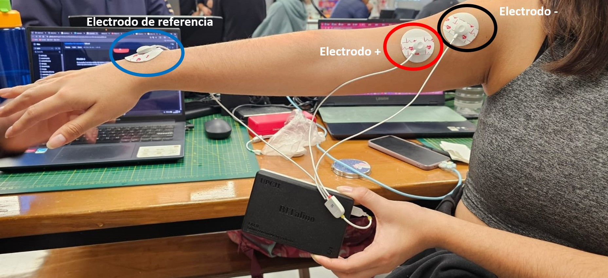

# **LABORATORIO 4: – USO DE BITalino PARA EMG**
# **Tabla de contenidos**

1. [Introducción](#id1)
2. [Objetivos](#id2)
3. [Materiales y equipos](#id3)
4. [Resultados](#id4)\
   4.1 [Conexión usada](#id5)\
   4.2 [Prueba 1: Bícep brachii](#id6)\
   4.3 [Prueba 2: Músculo aductor del pulgar](#id7)\
   4.4 [Prueba 3: Músculo gastrocnemio](#id8)\
   4.5 [Prueba 4: Tricep braquial](#id9)\
   4.6 [Archivos utilizados](#id10)
6. [Conclusiones](#id11)
6. [Referencias bibliográficas](#id12)

## **Introducción** 
Mencionar electricidad miografica
Aplicaciones de EMG y uso

## **Objetivos** 

* Adquirir señales biomédicas de EMG.
* Hacer una correcta configuración de BiTalino.
* Extraer la información de las señales EMG y ECG del software OpenSignals (r)evolution

## **Materiales y equipos** 

|  **Modelo**  | **Descripción** | **Cantidad** |
|:------------:|:---------------:|:------------:|
| (R)EVOLUTION |   Kit BITalino  |       1      |
|       -      |      Laptop     |       1      |
|       -      |    Electrodos superficiales   |       3      |

## **Resultados** 
### **Conexión usada** 
Se utilizó la conexión EMG en la placa Bitalino utilizando el sensor EMG de 3 electrodos como se muestra a continuación.

El siguiente procedimiento consiste en colocar los electrodos EMG en el usuario de prueba. Para ello se utilizó la Guía De Procedimiento de Electromiografía y velocidad de conducción de nervios periféricos del año 2020 elaborada por el Instituto Nacional del Niño de San Borja para el Ministerio de Salud (MINSA) *CAMBIAR Y BUSCAR UNA GUIA DE PROCEDIMIENTO 

### **Prueba 1: Bícep brachii** 
Descripción de prueba 1, fundamento de la señal adquirida (porque usaran ese grupo muscular de interes)

   
|  **Reposo**  | **Sin oposición** | **Con oposición** |
|:------------:|:---------------:|:------------:|
|<video src="https://user-images.githubusercontent.com/b49875f0-82ef-4d27-a2aa-e8e5e6103e9a.mp4"></video>|<video src="https://user-images.githubusercontent.com/092f3871-e25f-4d7b-a778-03641931fcaf.mp4"></video>|<video src= "https://user-images.githubusercontent.com/36d881ed-29d1-4178-844e-4b9741314f90.mp4"></video>|

- ### **Ploteo de la señal en Python: Dominio del tiempo y frecuencia**
   A coninuación se muestran la data obtenida en el dominio del tiempo y dominio de la frecuencia
   - Reposo
   - Esfuerzo
   - Sobreesfuerzo con oposición

### **Prueba 2: Músculo aductor del pulgar** 
Descripción de prueba 2, fundamento de la señal adquirida (porque usaran ese grupo muscular de interes)
Descripción de prueba 1, fundamento de la señal adquirida (porque usaran ese grupo muscular de interes)

   
|  **Reposo**  | **Esfuerzo** | **Sobreesfuerzo con oposición** |
|:------------:|:---------------:|:------------:|
|<video src="https://user-images.githubusercontent.com/67a14538-64fe-4a2a-a8d6-a3e4a3f076d5.mp4"></video>|<video src="https://user-images.githubusercontent.com/af3715f6-c9ae-4d9e-88d6-e9c4592ccc69.mp4"></video>|<video src= "https://user-images.githubusercontent.com/077e5478-1f01-4cbe-a1b1-619135a5ab11.mp4"></video>|

- ### **Ploteo de la señal en Python: Dominio del tiempo y frecuencia**
   A coninuación se muestran la data obtenida en el dominio del tiempo y dominio de la frecuencia
   - Reposo
   - Esfuerzo
   - Sobreesfuerzo con oposición

### **Prueba 3: Músculo gastrocnemio** 
Descripción de prueba 3, fundamento de la señal adquirida (porque usaran ese grupo muscular de interes)

   
|  **Reposo**  | **Esfuerzo** | **Sobreesfuerzo con oposición** |
|:------------:|:---------------:|:------------:|
|<video src="https://user-images.githubusercontent.com/27d392ad-a041-4e54-8f90-0a6b14e80f0f.mp4"></video>|<video src="https://user-images.githubusercontent.com/75a6c4f4-0524-44a8-b6da-cfe3df00bb69.mp4"></video>|<video src= "https://user-images.githubusercontent.com/68bb1c7a-39ac-415c-a21c-0ae45fc841b5.mp4"></video>|

- ### **Ploteo de la señal en Python: Dominio del tiempo y frecuencia**
   A coninuación se muestran la data obtenida en el dominio del tiempo y dominio de la frecuencia
   - Reposo
   - Esfuerzo
   - Sobreesfuerzo con oposición
     
### **Prueba 4: Tricep Braquial** 
Descripción de prueba 4, fundamento de la señal adquirida (porque usaran ese grupo muscular de interes)

   
|  **Reposo**  | **Esfuerzo** | **Sobreesfuerzo sin oposición** |
|:------------:|:---------------:|:------------:|
|<video src="https://user-images.githubusercontent.com/3d2e256b-1b0b-45e6-881a-7c67814c92b9.mp4"></video>|<video src="https://user-images.githubusercontent.com/c606cd01-5a08-4b8c-a946-48103dcaaec7.mp4"></video>|<video src= "https://user-images.githubusercontent.com/d8ca2d70-d802-41ab-8d84-04cf8d5b42a7.mp4"></video>|

- ### **Ploteo de la señal en Python: Dominio del tiempo y frecuencia**
   A coninuación se muestran la data obtenida en el dominio del tiempo y dominio de la frecuencia
   - Reposo
   - Esfuerzo
   - Sobreesfuerzo con oposición

### **Archivos** 
- [Documentos (.txt)](https://github.com/Grupo2-IntroduccionSenalesMedicas/S_biomedica/tree/main/Documentos/BiTalino)
- [Programa de ploteo (Jupyter Notebook)](https://github.com/Grupo2-IntroduccionSenalesMedicas/S_biomedica/blob/main/Programaci%C3%B3n/Laboratorio%203/SignalPlot.ipynb)

## **Conclusiones** 

## **Referencias bibliográficas** 
