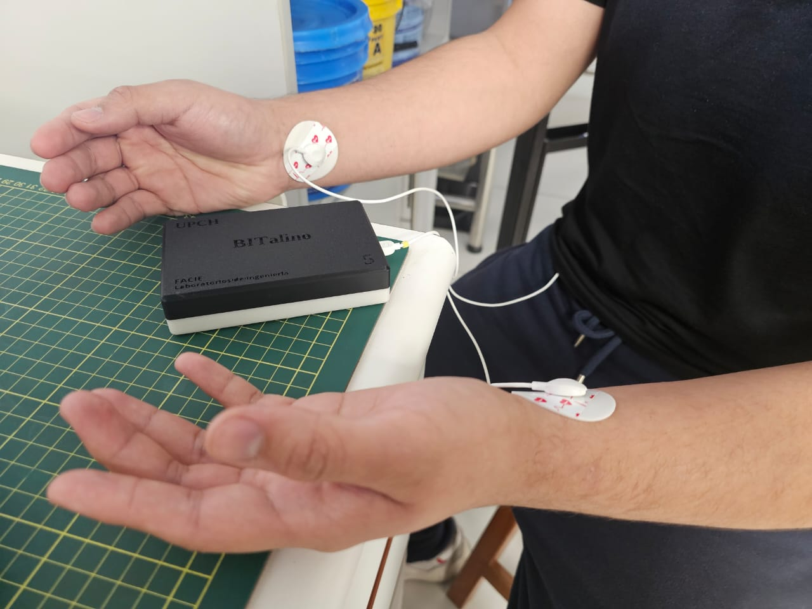
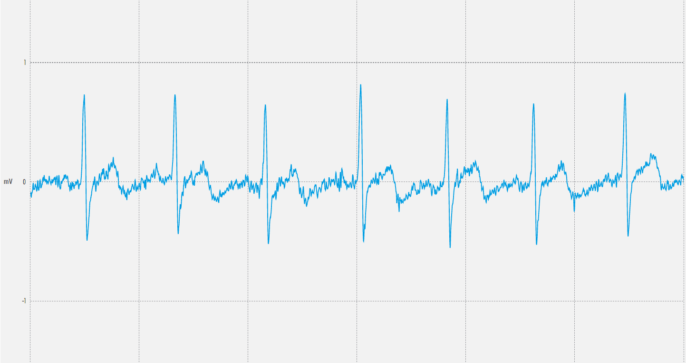
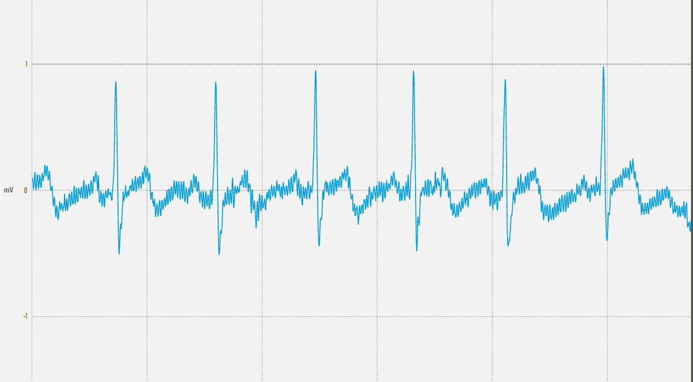
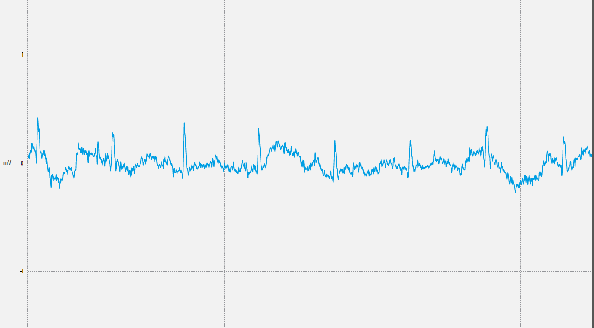
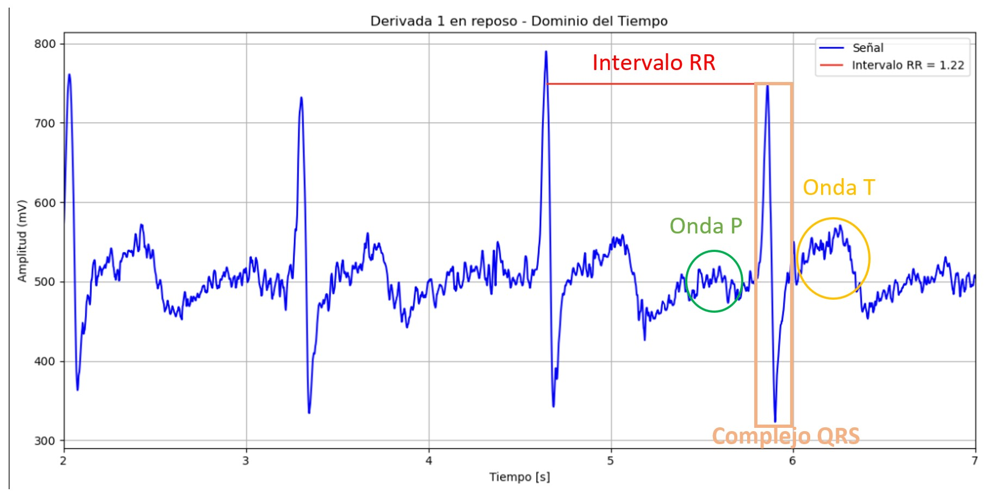
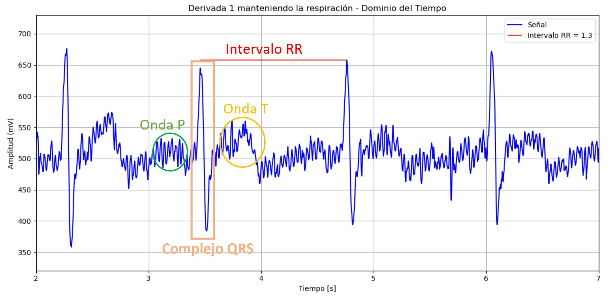
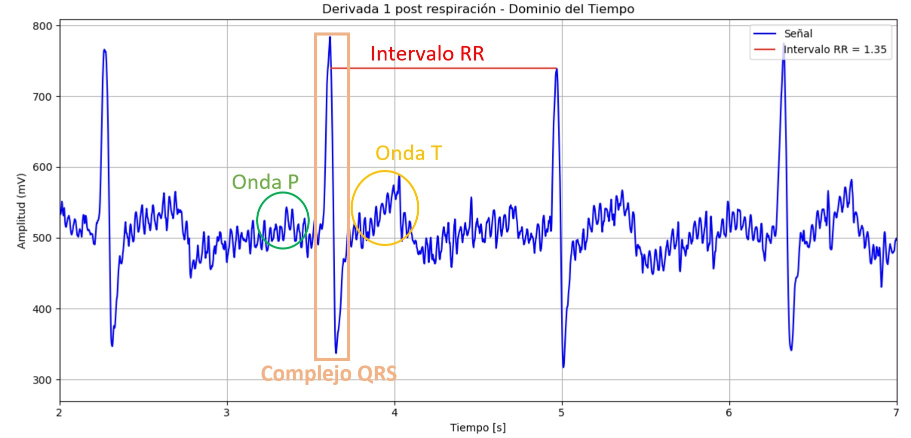

# **LABORATORIO 5: – USO DE BITalino PARA ECG**
# **Tabla de contenidos**

1. [Introducción](#id1)
2. [Objetivos](#id2)
3. [Materiales y equipos](#id3)
4. [Conexión usada y procedimiento](#id4)
5. [Resultados](#id5)\
   4.1 [Estado basal](#id6)\
   4.2 [Manteniendo la respiración por 10 segundos](#id7)\
   4.3 [Reposo basal](#id8)\
   4.4 [Después de una actividad física](#id9)\
   4.5 [Señal del Promsim4](#id10)\
   4.6 [Archivos](#id11)
6. [Conclusiones](#id12)
7. [Recomendaciones](#id13)
8. [Referencias bibliográficas](#id14)

## **Introducción** 
El ECG o electrocardiograma es una prueba médica que registra la actividad eléctrica del corazón. Cada latido genera impulsos eléctricos que viajan por el corazón y el ECG captura estos impulsos y los presenta como ondas en un gráfico. Con él podemos analizar el ritmo cardíaco, identificar arritmias y detectar posibles daños en el corazón.

## **Objetivos** 
* Adquirir señales biomédicas de ECG
* Hacer una correcta configuración de BiTalino.
* Extraer la información de las señales ECG del software OpenSignals (r)evolution
* Plotear las señales en dominio del tiempo y frecuencia en Python

## **Materiales y equipos** 

   
|  **Modelo**  | **Descripción** | **Cantidad** |
|:------------:|:---------------:|:------------:|
| (R)EVOLUTION |   Kit BITalino  |       1      |
|       -      |      Laptop     |       1      |
|       -      |    Electrodos   |       3      |

 Tabla 1: Materiales y equipos</i>

Figura 2: Kit BITalino y electrodos</i>

## **Conexión usada y procedimiento** 
### **Conexión usada** 
DESCRIBIR EL TIPO DE CONEXION PARA CADA DERIVACIÓN Y LA POSICION DE LOS ELECTRODOS PARA CADA UNA, PONER IMAGENES SEÑALANDO, COLOCAR QUE SE SIGUIO LA CONEXION DEL PDF DEL BITALINO Y UNA GUIA CLINICA: GUIA GUÍA DE PROCEDIMIENTO ASISTENCIAL: TOMA DE ELECTROCARDIOGRAMA DEL HOSPITAL NACIONAL HIPOLITO UNANUE”. O BUSCAR OTRA 
   1. I derivación bipolar
   2. II derivación bipolar
   3. III derivación bipolar
      

Figura 3: Conexión usada del BITalino y electrodos</i>

### **Procedimiento** 
COLOCAR PROCEDIMIENTO, SEÑALAR QUE MEDIMOS EL ECG EM ESTADO BASAL, EJERCICO, ETC Y QUE SE CAMBIABAN LAS POSICIONES DE LOS ELCETRODOS PARA TENER LAS 3 DERIVACIONES.  

## **Resultados** 
### **Estado basal** 
El sujeto de prueba se quedó quieto y manteniendo la calma
- ### **Ploteo en OpenSignals**
  

|                 **Derivación Bipolar**                 | **Señal en OpenSignal** |
|:------------------------------------------:|:---------:|
|                **I**                || 

| **II** || 

|                **III**                || 

- ### **Ploteo de la señal en Python: Dominio del tiempo y frecuencia**

   
|                 **Derivación Bipolar**                 | **Dominio del tiempo** |**Dominio de la frecuencia**|
|:------------------------------------------:|:---------:|:------------:|
|                **I**                |

|

|
| **II** |

|

|
|                **III**                |

|

|

Se analizó la primera derivación para poder identificar segmentos y ondas específicas. Además, se calculó el intervalo R-R en las señales para poder obtener los latidos por minuto (lpm) y poder compararlos con el dispositivo patrón (FLUKE ProSim4). En este semtido, el intervalo R-R en un ECG es el tiempo entre dos picos consecutivos de ondas R. La fórmula para calcular los latidos por minuto (lpm) a partir del intervalo R-R es:  

$$ LPM = \frac{60}{\text{Intervalo  R-R (segundos)}} $$

Figura 3: Identifiación de ondas para la I derivación en estado basal</i>

De la Figura 3, se obtuvo un intervalo de onda R-R de 1.22 segundos y aplicando la ecuación anterior se obtiene un lpm de 49.

### **Manteniendo la respiración por 10 segundos** 
El sujeto de prueba mantuvo la respiración por 10 segundos y se midió la inspiración y expiración
- ### **Ploteo en OpenSignals**

   
|                 **Derivación Bipolar**                 | **Señal en OpenSignal** |
|:------------------------------------------:|:---------:|
|                **I**                ||
| **II** ||
|                **III**                ||

- ### **Ploteo de la señal en Python: Dominio del tiempo y frecuencia**

|                 **Derivación Bipolar**                 | **Dominio del tiempo** |**Dominio de la frecuencia**|
|:------------------------------------------:|:---------:|:------------:|
|                **I**                |

|

|
| **II** |

|

|
|                **III**                |

|

|

Se analizó la primera derivación para poder identificar segmentos y ondas específicas cuando el sujeto mantiene la respiración por 10 segundos

Figura 4: Identifiación de ondas para la I derivación cuando el sujeto mantiene la respiración</i>

De la Figura 4, se obtuvo un intervalo de onda R-R de 1.3 segundos y aplicando la ecuación anterior se obtiene un lpm de 46.

### **Reposo basal** 
Reposo después de mantener la respiración
- ### **Ploteo en OpenSignals**

   
|                 **Derivación Bipolar**                 | **Señal en OpenSignal** |
|:------------------------------------------:|:---------:|
|                **I**                ||
| **II** ||
|                **III**                ||

- ### **Ploteo de la señal en Python: Dominio del tiempo y frecuencia**

|                 **Derivación Bipolar**                 | **Dominio del tiempo** |**Dominio de la frecuencia**|
|:------------------------------------------:|:---------:|:------------:|
|                **I**                |

|

|
| **II** |

|

|
|                **III**                |

|

|

Se analizó la primera derivación para poder identificar segmentos y ondas específicas cuando el sujeto está en estado basal.

Figura 4: Identifiación de ondas para la I derivación en estado basal</i>

De la Figura 4, se obtuvo un intervalo de onda R-R de 1.35 segundos y aplicando la ecuación anterior se obtiene un lpm de 44.

### **Después de una actividad física**  
El sujeto de prueba realizó movimientos aeróbicos
por 5 minutos
- ### **Ploteo en OpenSignals**

|                 **Derivación Bipolar**                 | **Señal en OpenSignal** |
|:------------------------------------------:|:---------:|
|                **I**                ||
| **II** ||
|                **III**                ||

- ### **Ploteo de la señal en Python: Dominio del tiempo y frecuencia**

   
|                 **Derivación Bipolar**                 | **Dominio del tiempo** |**Dominio de la frecuencia**|
|:------------------------------------------:|:---------:|:------------:|
|                **I**                |

|

|
| **II** |

|

|
|                **III**                |

|

|

Notamos que niguna de las 3 derivaciones muestra una señal ECG adecuada debido a que no se logra distinguir de forma adecuada las ondas y segmentos relevantes por lo que no es posible hallar los latidos por minuto. Probablemte se haya colocado los electrodos de forma incorrecta u otro problema durante la toma de datos.

### **Señal del Promsim4** 
Se realizó una simulación de diferentes latidos por minuto utilizando el dispositivo de metrología FLUKE ProSim4 que genera una señal patrón.

Figura 2: Conexión del Prosim y BITalino - 60 lpm</i>

   
|                 **Simulación**                 | **Toma en OpenSignal** |
|:------------------------------------------:|:---------:|
|**Simulación de 60 lpm - estado basal**||
|**Simulación de 120 lpm - empieza a agitarse**||
|**Simulación de 150 lpm - haciendo ejercicio**||
|**Simulación de 90 lpm - reponiendose**||

### **Archivos** 
- [Documentos (.txt)](https://github.com/DianaCortezL/ISB-Grupo-5/tree/ca2087a1e8c80dfdf1d244956771d8c6e7e543ac/Otros/Archivos%20varios/Lab5_ECG)
- [Programa de ploteo (Jupyter Notebook)](https://github.com/DianaCortezL/ISB-Grupo-5/blob/ca2087a1e8c80dfdf1d244956771d8c6e7e543ac/ISB/Laboratorios/Lab05%20-%20Adquisici%C3%B3n%20de%20se%C3%B1al%20ECG/LabECG.ipynb)

## **Conclusiones** 
   -

## **Recomendaciones** 
   -

## **Referencias bibliográficas** 
[1] 
‌
