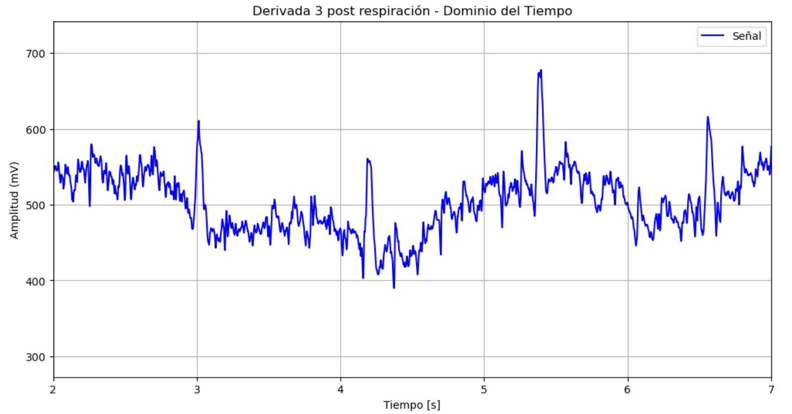

# **LABORATORIO 5: – USO DE BITalino PARA ECG**
# **Tabla de contenidos**

1. [Introducción](#id1)
2. [Objetivos](#id2)
3. [Materiales y equipos](#id3)
4. [Conexión usada y procedimiento](#id4)
5. [Resultados](#id5)\
   4.1 [Estado basal](#id6)\
   4.2 [Manteniendo la respiración por 10 segundos](#id7)\
   4.3 [Reposo basal](#id8)\
   4.4 [Después de una actividad física](#id9)\
   4.5 [Señal del Promsim4](#id10)\
   4.6 [Archivos](#id11)
6. [Conclusiones](#id12)
7. [Recomendaciones](#id13)
8. [Referencias bibliográficas](#id14)

## **Introducción** 
AAAAA Básicos del ECG, tipo de ondas, uso de ECG, derivaciones y descripción de lo que se hará en el lab

## **Objetivos** 
* Adquirir señales biomédicas de ECG
* Hacer una correcta configuración de BiTalino.
* Extraer la información de las señales ECG del software OpenSignals (r)evolution
* Plotear las señales en dominio del tiempo y frecuencia en Python

## **Materiales y equipos** 

   
|  **Modelo**  | **Descripción** | **Cantidad** |
|:------------:|:---------------:|:------------:|
| (R)EVOLUTION |   Kit BITalino  |       1      |
|       -      |      Laptop     |       1      |
|       -      |    Electrodos   |       3      |

 Tabla 1: Materiales y equipos</i>

Figura 2: Kit BITalino y electrodos de superficie</i>

## **Conexión usada y Procedimiento** 
### **Conexión usada** 
DESCRIBIR EL TIPO DE CONEXION PARA CADA DERIVACIÓN Y LA POSICION DE LOS ELECTRODOS PARA CADA UNA, PONER IMAGENES SEÑALANDO 
   1. I derivación bipolar
   2. II derivación bipolar
   3. III derivación bipolar

Figura 3: Conexión usada del BITalino y electrodos</i>

### **Procedimiento** 

El siguiente procedimiento consiste en colocar los electrodos EMG en el usuario de prueba. Para ello se utilizó la Guía De Procedimiento de Electromiografía y Velocidad de Conducción de nervios periféricos (2020) elaborada por el Instituto Nacional del Niño de San Borja para el Ministerio de Salud (MINSA) - GP-001/INSNSB/UAIE/SUAIEPSE – NEUROLOGIA PEDIATRICA V01 (RD N° 000226-2020-DG-INSNSB) [4].

## **Resultados** 
### **Estado basal** 
- ### **Ploteo en OpenSignals**
  

   
|                 **Derivación Bipolar**                 | **Señal en OpenSignal** |
|:------------------------------------------:|:---------:|
|                **I**                ||
| **II** ||
|                **III**                ||

- ### **Ploteo de la señal en Python: Dominio del tiempo y frecuencia**

   
|                 **Derivación Bipolar**                 | **Dominio del tiempo** |**Dominio de la frecuencia**|
|:------------------------------------------:|:---------:|:------------:|
|                **I**                |

|

|
| **II** |

|

|
|                **III**                |

|

|

### **Manteniendo la respiración por 10 segundos** 
- ### **Ploteo en OpenSignals**

   
|                 **Derivación Bipolar**                 | **Señal en OpenSignal** |
|:------------------------------------------:|:---------:|
|                **I**                ||
| **II** ||
|                **III**                ||

- ### **Ploteo de la señal en Python: Dominio del tiempo y frecuencia**

|                 **Derivación Bipolar**                 | **Dominio del tiempo** |**Dominio de la frecuencia**|
|:------------------------------------------:|:---------:|:------------:|
|                **I**                |

|

|
| **II** |

|

|
|                **III**                |

|

|

### **Reposo basal** 
- ### **Ploteo en OpenSignals**

   
|                 **Derivación Bipolar**                 | **Señal en OpenSignal** |
|:------------------------------------------:|:---------:|
|                **I**                ||
| **II** ||
|                **III**                ||

- ### **Ploteo de la señal en Python: Dominio del tiempo y frecuencia**

|                 **Derivación Bipolar**                 | **Dominio del tiempo** |**Dominio de la frecuencia**|
|:------------------------------------------:|:---------:|:------------:|
|                **I**                |

|

|
| **II** |

|

|
|                **III**                |

|

|

### **Después de una actividad física**    
- ### **Ploteo en OpenSignals**

|                 **Derivación Bipolar**                 | **Señal en OpenSignal** |
|:------------------------------------------:|:---------:|
|                **I**                ||
| **II** ||
|                **III**                ||

- ### **Ploteo de la señal en Python: Dominio del tiempo y frecuencia**

   
|                 **Derivación Bipolar**                 | **Dominio del tiempo** |**Dominio de la frecuencia**|
|:------------------------------------------:|:---------:|:------------:|
|                **I**                |

|

|
| **II** |

|

|
|                **III**                |

|

|

### **Señal del Promsim4** 
Se realizó una simulación de diferentes latidos por minuto utilizando el dispositivo de metrología FLUKE ProSim4 que genera una señal patrón.

Figura 2: Conexión del Prosim y BITalino - 60 lpm</i>

   
|                 **Simulación**                 | **Toma en OpenSignal** |
|:------------------------------------------:|:---------:|
|**Simulación de 60lpm - estado basal**||
|**Simulación de 120lpm - empieza a agitarse**||
|**Simulación de 150lpm - haciendo ejercicio**||
|**Simulación de 90lpm - reponiendose**||

### **Archivos** 
- [Documentos (.txt)](https://github.com/DianaCortezL/ISB-Grupo-5/tree/ca2087a1e8c80dfdf1d244956771d8c6e7e543ac/Otros/Archivos%20varios/Lab5_ECG)
- [Programa de ploteo (Jupyter Notebook)](https://github.com/DianaCortezL/ISB-Grupo-5/blob/ca2087a1e8c80dfdf1d244956771d8c6e7e543ac/ISB/Laboratorios/Lab05%20-%20Adquisici%C3%B3n%20de%20se%C3%B1al%20ECG/LabECG.ipynb)

## **Conclusiones** 
   -

## **Recomendaciones** 
   -

## **Referencias bibliográficas** 
[1] D. Farina, D. F. Stegeman, and R. Merletti, “Biophysics of the Generation of EMG Signals,” Surface Electromyography : Physiology, Engineering, and Applications, pp. 1–24, Apr. 2016, doi: https://doi.org/10.1002/9781119082934.ch02.  

[2] D. Jiménez y J. Antonio, “Análisis de las señales EMG de superficie del bíceps durante la ejecución de ejercicios con pesas /”, Universidad Tecnológica de Bolívar, 2015.

[3]  M. B. I. Reaz, M. S. Hussain, and F. Mohd-Yasin, “Techniques of EMG signal analysis: detection, processing, classification and applications,” Biological Procedures Online, vol. 8, no. 1, pp. 11–35, Dec. 2006, doi: https://doi.org/10.1251/bpo115.  

[4] MINSA, GUÍA DE PROCEDIMIENTO DE ELECTROMIOGRAFÍA Y VELOCIDAD DE CONDUCCIÓN DE NERVIOS PERIFÉRICOS UNIDAD DE ATENCIÓN INTEGRAL ESPECIALIZADA SUB UNIDAD DE ATENCION INTEGRAL ESPECIALIZADA PEDIÁTRICA Y SUB ESPECIALIDADES NEUROLOGIA PEDIATRICA. Disponible en: https://www.insnsb.gob.pe/docs-trans/resoluciones/archivopdf.php?pdf=2020/RD%20N%C2%B0%20000226-2020-DG-INSNSB%20Gu%C3%ADa%20Proced%20Electromiograf%C3%ADa_2020%203REV%20UGC%20CHN%2019.06.2020.pdf  

[5] I. Campanini, A. Merlo, C. Disselhorst-Klug, L. Mesin, S. Muceli, and R. Merletti, “Fundamental Concepts of Bipolar and High-Density Surface EMG Understanding and Teaching for Clinical, Occupational, and Sport Applications: Origin, Detection, and Main Errors,” Sensors, vol. 22, no. 11, p. 4150, May 2022, doi: https://doi.org/10.3390/s22114150.

‌
