# **LABORATORIO 5: – USO DE BITalino PARA ECG**
# **Tabla de contenidos**

1. [Introducción](#id1)
2. [Objetivos](#id2)
3. [Materiales y equipos](#id3)
4. [Conexión usada y procedimiento](#id4)
5. [Resultados](#id5)\
   4.1 [Estado basal](#id6)\
   4.2 [Manteniendo la respiración por 10 segundos](#id7)\
   4.3 [Reposo basal](#id8)\
   4.4 [Después de una actividad física](#id9)\
   4.5 [Señal del Promsim4](#id10)\
   4.6 [Archivos](#id11)
6. [Conclusiones](#id12)
7. [Recomendaciones](#id13)
8. [Referencias bibliográficas](#id14)

## **Introducción** 
El ECG o electrocardiograma es una prueba médica que registra la actividad eléctrica del corazón. Cada latido genera impulsos eléctricos que viajan por el corazón y el ECG captura estos impulsos y los presenta como ondas en un gráfico. Con él podemos analizar el ritmo cardíaco, identificar arritmias y detectar posibles daños en el corazón.

Las señales ECG son captadas mediante electrodos colocados en la superficie corporal, permitiendo el diagnóstico y monitoreo de condiciones cardíacas como arritmias, infartos de miocardio y otras alteraciones del ritmo cardíaco 

El ciclo cardíaco esta compuesto de diferentes ondas: [1]

   - Onda P: Es la primera onda del ciclo cardíaco y representa la despolarización de las aurículas.  
   
   - Onda Q: Es la primera onda correspondiente al complejo QRS, su valor es negativo.  
   
   - Onda R: Es la segunda onda correspondiente al complejo QRS, su valor es positivo y se ve representada por un pico de gran tamaño.  
   
   - Onda S: Es la última onda correspondiente al compejo QRS, su valor es negativo y similar al de la onda Q.  
   
   - Onda T: Representa la repolarización de los ventrículos, posee una menor amplitud que el complejo QRS.  
   
   - Onda U: Onda habitualmente positiva y de poca amplitud. Suele aparecer en las derivaciones precordiales.  
   
   
Esta prueba es usada es diferentes circunstancias en el entorno médico, su uso comprende desde el monitoreo de pacientes hospitalizados o durante una cirujía, hasta revisiones rutinarias. Otra función fundamental de esta prueba es el diagnóstico de patologías cardíacas como arritmias, infartos al miocardio, taquicardias, etc.

En este laboratorio, se utilizarán tres electrodos para adquirir las señales de ECG de las derivadas de Einthoven I, II y III. Para poder obtener una visión completa de las tres derivadas de Einthoven utilizando solo tres electrodos, se realizarán cambios en la posición de estos.

## **Objetivos** 
* Adquirir señales biomédicas de ECG
* Hacer una correcta configuración de BiTalino.
* Extraer la información de las señales ECG del software OpenSignals (r)evolution
* Plotear las señales en dominio del tiempo y frecuencia en Python

## **Materiales y equipos** 

   
|  **Modelo**  | **Descripción** | **Cantidad** |
|:------------:|:---------------:|:------------:|
| (R)EVOLUTION |   Kit BITalino  |       1      |
|       -      |      Laptop     |       1      |
|       -      |    Electrodos   |       3      |

 Tabla 1: Materiales y equipos</i>

Figura 2: Kit BITalino y electrodos</i>

## **Conexión usada y procedimiento** 
### **Conexión usada** 
Para la correcta colocación de los electrodos, seguimos dos guías: la "Guía de Procedimiento Asistencial: Toma de Electrocardiograma del Hospital Hipólito Unanue" [2] y la guía de uso del dispositivo Bitalino [3].

   1. I derivación bipolar: La señal se mide del brazo derecho al brazo izquierdo, capturando la actividad eléctrica desde una vista lateral del corazón.
      Posición de los electrodos: 
         - Electrodo negativo (RA): brazo derecho
         - Electrodo positivo (LL): pierna izquierda
         - Electrodo de referencia (RL): pierna derecha
   

   2. II derivación bipolar: La señal se mide desde el brazo derecho hasta la pierna izquierda, siendo una de las derivadas más comunes para el diagnóstico.

      Posición de los electrodos:
         - Electrodo negativo (RA): brazo derecho
         - Electrodo positivo (LL): pierna izquierda
         - Electrodo de referencia (RL): pierna derecha

   3. III derivación bipolar: La señal se mide del brazo izquierdo a la pierna izquierda, proporcionando una vista adicional del corazón.

      Posición de los electrodos:
         - Electrodo negativo (LA): brazo izquierdo
         - Electrodo positivo (LL): pierna izquierda
         - Electrodo de referencia (RL): pierna derecha

Figura 3: Conexión usada del BITalino y electrodos</i>

### **Procedimiento** 
Se realizó la adquisición de las señales ECG en cuatro condiciones diferentes: estado basal, contención de la respiración, post-contención de la respiración y después de actividad física. Para cada una de estas etapas, se midieron las tres derivadas de Einthoven (I, II y III), cambiando las posiciones de los electrodos de acuerdo a la derivada correspondiente
   1. Estado basal: Con el sujeto en reposo, se tomaron las tres derivadas de Einthoven, cambiando las conexiones de los cables para obtener cada derivada.
   2. Contención de la respiración: El sujeto mantuvo la respiración durante 10 segundos, y durante ese tiempo, se registraron las tres derivadas.
   3. Post-contención de la respiración: Inmediatamente después de la contención, con el sujeto de vuelta en estado basal, se volvieron a registrar las tres derivadas.
   4. Después de actividad física: El sujeto realizó ejercicio durante 5 minutos y, al finalizar, se tomaron nuevamente las tres derivadas en su estado de recuperación.

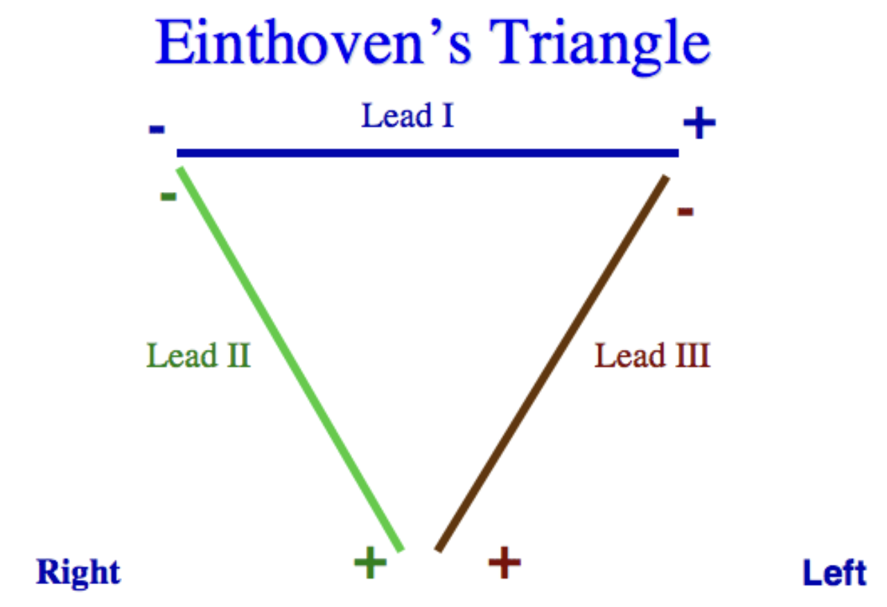

Figura 4: Triangulo de Einthoven [4]</i>

Figura 5: 3 derivadas de Einthoven</i>

## **Resultados** 
### **Estado basal** 
El sujeto de prueba se quedó quieto y manteniendo la calma
- ### **Ploteo en OpenSignals**
  

 
|         **Derivación Bipolar**        |                                              **Señal en OpenSignal**                                   |
|:-------------------------------------:|:------------------------------------------------------------------------------------------------------:|
|                **I**                  | 

|
|                **II**                 | 

|
|                **III**                | 

|

- ### **Ploteo de la señal en Python: Dominio del tiempo y frecuencia**

   
|                 **Derivación Bipolar**                 | **Dominio del tiempo** |**Dominio de la frecuencia**|
|:------------------------------------------:|:---------:|:------------:|
|                **I**                |

|

|
| **II** |

|
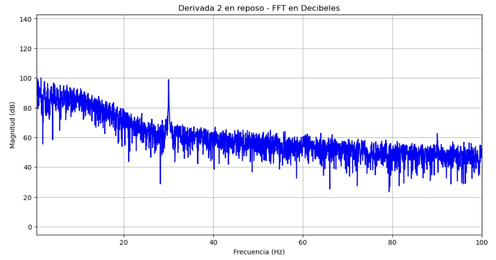
|
|                **III**                |

|

|

Se analizó la primera derivación para poder identificar segmentos y ondas específicas. Además, se calculó el intervalo R-R en las señales para poder obtener los latidos por minuto (lpm) y poder compararlos con el dispositivo patrón (FLUKE ProSim4). En este semtido, el intervalo R-R en un ECG es el tiempo entre dos picos consecutivos de ondas R. La fórmula para calcular los latidos por minuto (lpm) a partir del intervalo R-R es:  

$$ LPM = \frac{60}{\text{Intervalo  R-R (segundos)}} $$

Figura 6: Identifiación de ondas para la I derivación en estado basal</i>

De la Figura 6, se obtuvo un intervalo de onda R-R de 1.22 segundos y aplicando la ecuación anterior se obtiene un lpm de 49.

### **Manteniendo la respiración por 10 segundos** 
El sujeto de prueba mantuvo la respiración por 10 segundos y se midió la inspiración y expiración
- ### **Ploteo en OpenSignals**

  
|         **Derivación Bipolar**        |                                              **Señal en OpenSignal**                                   |
|:-------------------------------------:|:------------------------------------------------------------------------------------------------------:|
|                **I**                  | 
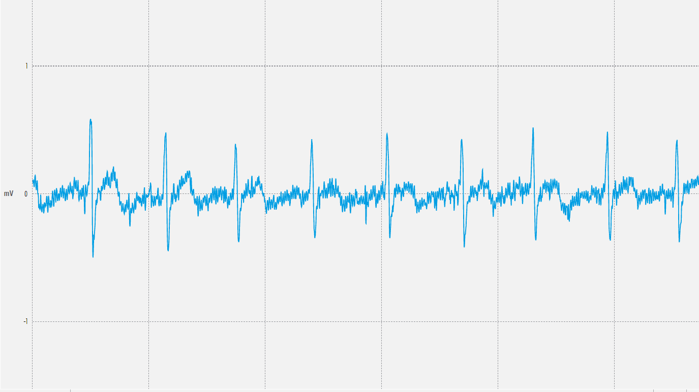
|
|                **II**                 | 
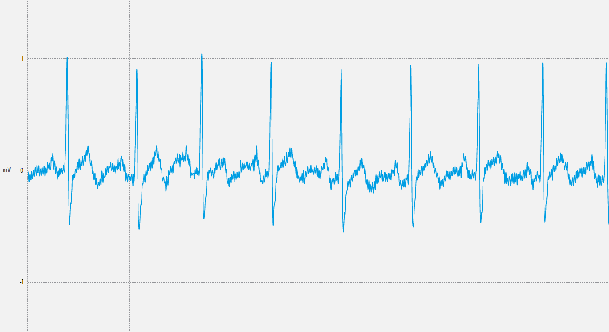
|
|                **III**                | 
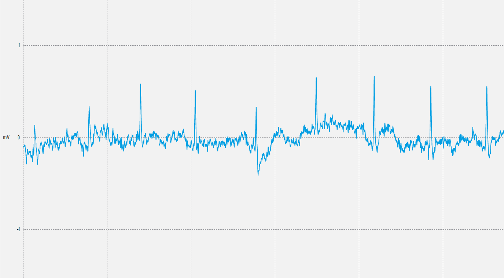
|

- ### **Ploteo de la señal en Python: Dominio del tiempo y frecuencia**

|                 **Derivación Bipolar**                 | **Dominio del tiempo** |**Dominio de la frecuencia**|
|:------------------------------------------:|:---------:|:------------:|
|                **I**                |

|
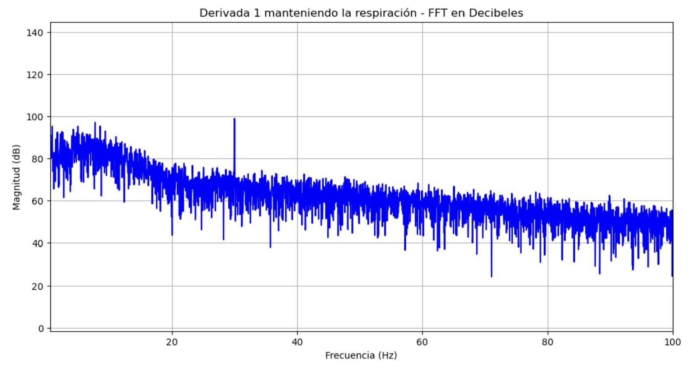
|
| **II** |

|

|
|                **III**                |

|

|

Se analizó la primera derivación para poder identificar segmentos y ondas específicas cuando el sujeto mantiene la respiración por 10 segundos

Figura 7: Identifiación de ondas para la I derivación cuando el sujeto mantiene la respiración</i>

De la Figura 7, se obtuvo un intervalo de onda R-R de 1.3 segundos y aplicando la ecuación anterior se obtiene un lpm de 46.

### **Reposo basal** 
Reposo después de mantener la respiración
- ### **Ploteo en OpenSignals**

   
|         **Derivación Bipolar**        |                                              **Señal en OpenSignal**                                   |
|:-------------------------------------:|:------------------------------------------------------------------------------------------------------:|
|                **I**                  | 
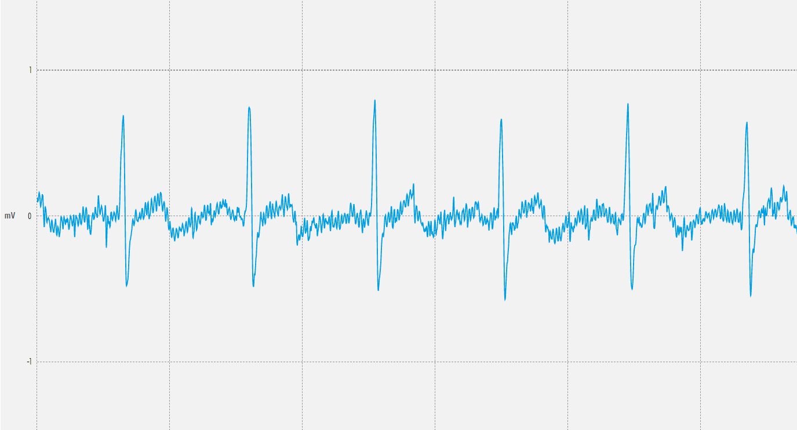
|
|                **II**                 | 
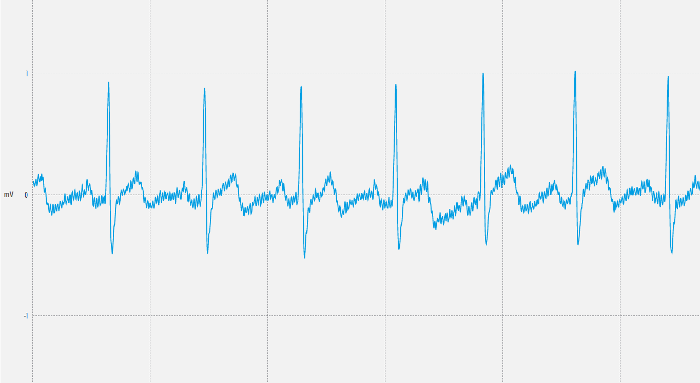
|
|                **III**                | 
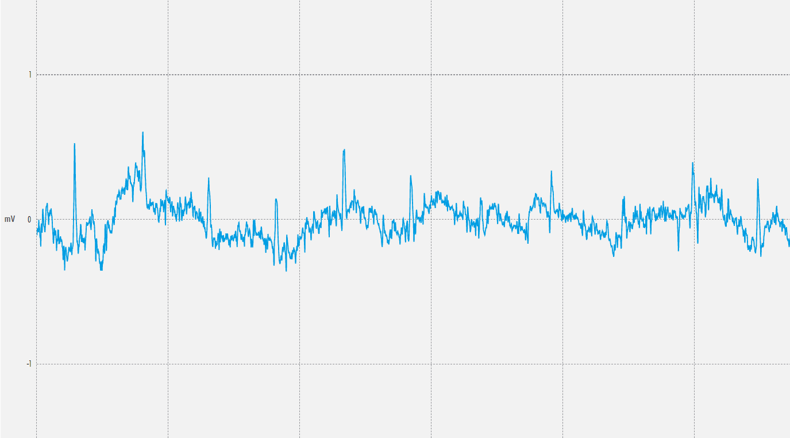
|

- ### **Ploteo de la señal en Python: Dominio del tiempo y frecuencia**

|                 **Derivación Bipolar**                 | **Dominio del tiempo** |**Dominio de la frecuencia**|
|:------------------------------------------:|:---------:|:------------:|
|                **I**                |

|

|
| **II** |

|

|
|                **III**                |

|

|

Se analizó la primera derivación para poder identificar segmentos y ondas específicas cuando el sujeto está en estado basal.

Figura 8: Identifiación de ondas para la I derivación en estado basal</i>

De la Figura 8, se obtuvo un intervalo de onda R-R de 1.35 segundos y aplicando la ecuación anterior se obtiene un lpm de 44.

### **Después de una actividad física**  
El sujeto de prueba realizó movimientos aeróbicos
por 5 minutos
- ### **Ploteo en OpenSignals**

|         **Derivación Bipolar**        |                                              **Señal en OpenSignal**                                   |
|:-------------------------------------:|:------------------------------------------------------------------------------------------------------:|
|                **I**                  | 
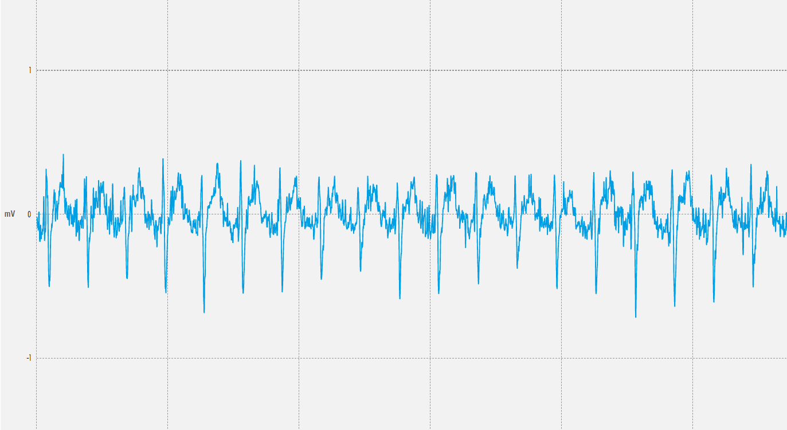
|
|                **II**                 | 

|
|                **III**                | 
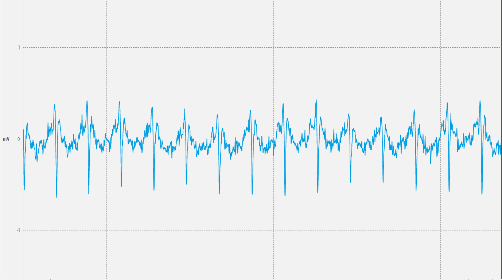
|

- ### **Ploteo de la señal en Python: Dominio del tiempo y frecuencia**

   
|                 **Derivación Bipolar**                 | **Dominio del tiempo** |**Dominio de la frecuencia**|
|:------------------------------------------:|:---------:|:------------:|
|                **I**                |

|

|
| **II** |

|

|
|                **III**                |

|

|

Notamos que niguna de las 3 derivaciones muestra una señal ECG adecuada debido a que no se logra distinguir de forma adecuada las ondas y segmentos relevantes por lo que no es posible hallar los latidos por minuto. Probablemte se haya colocado los electrodos de forma incorrecta u otro problema durante la toma de datos.

### **Señal del Promsim4** 
Se realizó una simulación de diferentes latidos por minuto utilizando el dispositivo de metrología FLUKE ProSim4 que genera una señal patrón.

Figura 9: Conexión del Prosim y BITalino - 60 lpm</i>

   
|                 **Simulación**                 | **Toma en OpenSignal** |
|:------------------------------------------:|:---------:|
|**Simulación de 60 lpm - estado basal**||
|**Simulación de 120 lpm - empieza a agitarse**||
|**Simulación de 150 lpm - haciendo ejercicio**||
|**Simulación de 90 lpm - reponiendose**||

### **Archivos** 
- [Documentos (.txt)](https://github.com/DianaCortezL/ISB-Grupo-5/tree/ca2087a1e8c80dfdf1d244956771d8c6e7e543ac/Otros/Archivos%20varios/Lab5_ECG)
- [Programa de ploteo (Jupyter Notebook)](https://github.com/DianaCortezL/ISB-Grupo-5/blob/ca2087a1e8c80dfdf1d244956771d8c6e7e543ac/ISB/Laboratorios/Lab05%20-%20Adquisici%C3%B3n%20de%20se%C3%B1al%20ECG/LabECG.ipynb)

## **Conclusiones** 
   -

## **Recomendaciones** 
   -

## **Referencias bibliográficas** 
[1] Las ondas del electrocardiograma (ECG)," My EKG, 2024. [En línea]. Disponible en: https://www.my-ekg.com/generalidades-ekg/ondas-electrocardiograma.html. 

‌[2] "Guía de Procedimiento Asistencial: Toma de Electrocardiograma del Hospital Nacional Hipólito Unanue," Hospital Nacional Hipólito Unanue, Ministerio de Salud, Perú, 2022. [En línea]. Disponible en: https://cdn.www.gob.pe/uploads/document/file/3457356/RESOLUCI%C3%93N%20DIRECTORAL%20N%C2%B0%20192-2022-.pdf.pdf

[3] M. Proença y K. Mrotzcek, "BITalino HomeGuide," PLUX – Wireless Biosignals, S.A., Lisboa, Portugal, 2021. [En línea]. Disponible en: http://BITalino.com/.

[4] “Einthoven’s Triangle,” Unm.edu, 2024. [En línea]. Disponible en: https://www.unm.edu/~lkravitz/EKG/einthoven.html. 
