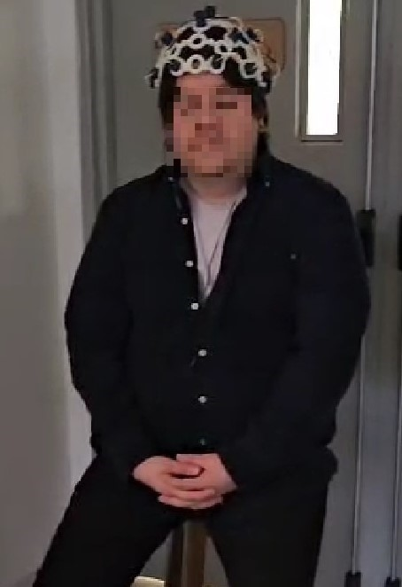
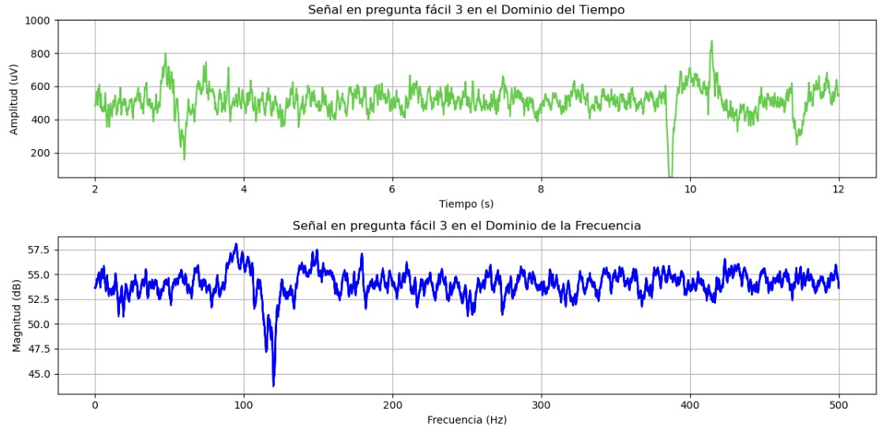

# **LABORATORIO 6: – USO DE BITalino PARA EEG**
# **Tabla de contenidos**

1. [Introducción](#id1)
2. [Objetivos](#id2)
3. [Materiales y equipos](#id3)
4. [Conexión usada y procedimiento](#id4)
5. [Resultados](#id5)\
   5.1 [Señal con OpenBCI Ultracortex "Mark IV"](#id6)\
   5.2 [Señal con BITalino](#id7)\
   5.3 [Archivos](#id8)
7. [Conclusiones](#id9)
8. [Recomendaciones](#id10)
9. [Referencias bibliográficas](#id11)

## **Introducción** 
El EEG o electroencefalograma es una prueba médica que registra la actividad eléctrica del cerebro. Los impulsos eléctricos generados por las neuronas viajan a través del cerebro, y el EEG captura estos impulsos y los presenta como ondas en un gráfico. A través del EEG, podemos analizar la actividad cerebral, identificar trastornos como epilepsia, monitorizar el estado de coma y estudiar patrones de sueño, entre otras aplicaciones. [1, 2]

Las señales de EEG se captan mediante electrodos colocados en el cuero cabelludo, permitiendo el diagnóstico y monitoreo de condiciones neurológicas. Las ondas cerebrales se dividen en diferentes tipos, clasificadas por su frecuencia (número de veces que se repite una onda en un segundo): [3]
   - Ondas Delta (0.2 - 4 Hz): Ondas muy lentas y las de mayor amplitud, están asociadas con el sueño profundo, coincide con la regeneración y restauración del Sistema Nervioso Central.
   - Ondas Theta (4 - 8 Hz): Relacionadas con estados de relajación profunda y meditación. Son muy importantes durante el aprendizaje y memoria. Se producen durante la transición entre vigilia y sueño.
   - Ondas Alfa (8 - 12 Hz): Asociadas a la relajación con los ojos cerrados y la actividad en reposo. Si hay déficit de alfa el individuo tiene dificultad para relajarse. Esta frecuencia ayuda a la coordinación mental, la integración mente/cuerpo, la calma y la alerta.
   - Ondas Beta (12 - 30 Hz): Se presentan durante la actividad mental y el estado de alerta. Un exceso de Beta consume mucha energía. El mapa cerebral de un paciente con trastorno de ansiedad puede mostrar un exceso de Beta 2 o 3.
   - Ondas Gamma (30 - 90 Hz): Involucradas en procesos cognitivos complejos y la consolidación de la memoria. Se observan ráfagas de ondas Gamma cuando el cerebro está en estado de alta resolución. (Ejemplo durante el cálculo de una fórmula matemática).

El EEG es utilizado en distintas situaciones en el ámbito clínico, como en el diagnóstico de epilepsias, alteraciones del sueño y encefalopatías, así como para la investigación de la actividad cerebral en estudios cognitivos y del comportamiento. [2]

## **Objetivos** 
* Adquirir señales biomédicas de EEG utilizando el Kit BITalino (R)evolution
* Obtener señales de EEG utilizando Ultracortex Mark IV EEG Headset y la tarjeta de biosensado Cyton de 8 canales.
* Plotear las señales en dominio del tiempo y frecuencia en Python

## **Materiales y equipos** 

   
|  **Modelo**  | **Descripción** | **Cantidad** |
|:------------:|:---------------:|:------------:|
| (R)EVOLUTION |   Kit BITalino  |       1      |
|       -      |      Laptop     |       1      |
|       -      |    Electrodos   |       3      |
|    OpenBCI   |    Ultracortex Mark IV EEG Headset   |       1      |
|    OpenBCI   |   OpenBCI Cyton 8-channel Board   |       1      |

 Tabla 1: Materiales y equipos</i>

Figura 1: Ultracortex Mark IV EEG Headset</i>

  

Figura 2: BITalino y electrodos</i>

## **Conexión usada y procedimiento** 
### **Conexión usada** 
En este laboratorio utilizamos 2 sistemas de conexión :

1. BITalino Board + Electrodos:
   - Usamos tres electrodos para la adquisición de la señal EEG, siguiendo la guía de BITalino. Dos electrodos se colocaron en la frente y uno detrás de la oreja. Se siguió el procedimiento de la guía de BITalino: "BITalino (r)revolution Home Guide #3 - ELECTROENCEPHALOGRAPHY (EEG)" [4]. En la Fig. 3 se muestra una representación esquemática de la posición de electrodos. En la Fig. 4 y 5 la se observa la colocación de los electrodos en el sujeto de prueba.

Figura 3: Representación esquemática de la osición de los electrodos para obtención de la señal EEG usando el BITalino [4]</i>

Figura 4: Posición de los electrodos (positivo y negativo) en el sujeto de prueba</i>

Figura 5: Posición de los electrodos en el sujeto de prueba</i>

2. Ultracortex Mark IV + Tarjeta Cyton:
   - Se utilizó el Ultracortex Mark IV EEG Headset, un casco equipado con múltiples electrodos integrados. La tarjeta de biosensado Cyton de 8 canales permitió la recopilación de las señales capturadas por el headset. El Ultracortex fue ajustado cuidadosamente mediante las perillas de ajuste para asegurar un contacto óptimo con el cuero cabelludo y una señal EEG clara.

Figura 6: Uso del Ultracortex Mark IV </i>

### **Procedimiento - Obtención de señales EEG** 
Para la obtención de la señal EEG con el BITalino y el UltraCortex MARK IV se utilizó el siguiente procedimiento:
   - Se registró una línea base de la señal EEG con poco ruido y sin movimientos (respiración normal, sin movimientos oculares / ojos cerrados) durante 30 segundos.
   - Se registró la señal EEG repitiendo 5 ciclos de 10 segundos de ojos abiertos - ojos cerrados
   - Se registró la señal EEG en reposo durante 30 segundos nuevamente
   - Se registró la señal EEG en un estado de razonamiento lógico-matemático a través de preguntas fáciles y complejas:
      - Preguntas fáciles realizadas: 
         - Una tienda tiene 7 camisetas y vende 3 ¿Cuántas camisetas quedan en la tienda?
         - En una caja hay 10 libros y se sacan 2 ¿Cuántos libros quedan en la caja?
         - Hay 4 gatos en una casa y llegan 3 más. ¿Cuántos gatos hay ahora?
      - Preguntas complejas realizadas:
         - Juan anotó 30 puntos en un juego, que es 5 más que lo que anotó Pedro. Carlos anotó 12 puntos más que la suma de Juan y Pedro. ¿Cuántos puntos anotó Carlos?
         - Un campo tiene 70 árboles, 20 más que el campo B. Otro campo C tiene 10 árboles menos que la suma de los campos A y B. ¿Cuántos árboles tiene el campo C?
         - ¿Cuánto es la raíz de 9 al cuadrado más 40?

## **Resultados** 
### **Señal con OpenBCI Ultracortex "Mark IV"** 
- ### **Gráficos en OpenBCI GUI**
  

 
|         **Fase**          |   **Gráfico en OpenBCI GUI**    |
|:-------------------------------------:|:---------------------------------------------------------------------:|
|                **Fase de referencia de 30 segundos**                  | |
|                **Realizando secuencia de ojos abiertos - ojos cerrados**                 | |
|                **Respondiendo preguntas categoría simple**                | |
|                **Respondiendo preguntas categoría compleja**                | |

### **Señal con BITalino** 
- ### **Gráficos en OpenSignals**
A continuacion mostraremos los graficos ploteados en Open Signals.

 
|         **Fase**                                              |                       **Gráfico en OpenSignals**                      |
|:-------------------------------------------------------------:|:---------------------------------------------------------------------:|
|  **Fase de referencia de 30 segundos**                        | 

|  **Realizando secuencia de ojos abiertos - ojos cerrados**    | 

|  **Respondiendo preguntas categoría simple**                  | 

|  **Respondiendo preguntas categoría compleja**                | 

|

- ### **Gráficos en Python**
Asimismo, se realizo el ploteo de las señales de OpenSignals en Python. Se graficó en dominio del tiempo y de frecuencia\  

   **1. Línea base 1 de la señal EEG con poco ruido y sin movimientos**

Figura 7: Señal EEG en dominio de tiempo y freciencia de un ciclo sin movimientos oculares y con los ojos cerrados</i>

   2. Señal EEG repitiendo 5 ciclos de 10 segundos de ojos abiertos - ojos cerrados

Figura 8: Señal EEG en dominio de tiempo y frecuencia de un ciclo de ojos abiertos y ojos cerrados</i>

   **3. Línea base 2 de la señal EEG con poco ruido y sin movimientos**

Figura 9: Señal EEG en dominio de tiempo y freciencia de un ciclo sin movimientos oculares y con los ojos cerrados</i>

  **4. Señal completa de EEG durante sesion de preguntas fáciles**\
A continuación, se muestran las señale ploteadas en Python de las 3 preguntas fáciles que se le realizó al sujeto. Se muestran en el dominio del tiempo y frecuencia

Figura 10: Señal EEG en dominio de tiempo y frecuencia durante pregunta fácil 1</i>

Figura 11: Señal EEG en dominio de tiempo y frecuencia durante pregunta fácil 2</i>

Figura 12: Señal EEG en dominio de tiempo y frecuencia durante pregunta fácil 3</i>

  **5. Señal completa de EEG durante sesion de preguntas difíciles**\
A continuación, se muestran las señale ploteadas en Python de las 3 preguntas difíciles que se le realizó al sujeto. Se muestran en el dominio del tiempo y frecuencia

Figura 13: Señal EEG en dominio de tiempo y frecuencia durante pregunta difícil 1</i>

Figura 14: Señal EEG en dominio de tiempo y frecuencia durante pregunta difícil 2</i>

Figura 15: Señal EEG en dominio de tiempo y frecuencia durante pregunta difícil 3</i>

   
### **Archivos** 
- [Documentos (.txt)](https://github.com/DianaCortezL/ISB-Grupo-5/tree/88e031b9ee680d6403ba408c9e73f99652f8cca3/Otros/Archivos%20varios/Lab6_EEG)
- [Programa de ploteo (Jupyter Notebook)](https://github.com/DianaCortezL/ISB-Grupo-5/blob/01dd208ed2c0990ba65ef55da91e29f922fbb739/ISB/Laboratorios/Lab06%20-%20Adquisi%C3%B3n%20de%20se%C3%B1al%20EEG/LabEEG.ipynb)

## **Conclusiones** 
   - 

## **Recomendaciones** 
   - 

## **Referencias bibliográficas** 

[1] “Electroencefalografía (EEG) - Mayo Clinic,” Mayoclinic.org, 2024. https://www.mayoclinic.org/es/tests-procedures/eeg/about/pac-20393875 (accessed Sep. 28, 2024).

[2] C. Clinic, “EEGs (electroencephalograms) are tests that evaluate brain function. Healthcare providers order EEGs to diagnose brain issues like epilepsy or dementia.,” Cleveland Clinic, Nov. 16, 2016. https://my.clevelandclinic.org/health/diagnostics/9656-electroencephalogram-eeg (accessed Sep. 28, 2024).

[3] neurofeedback, “¿Qué son las ondas Cerebrales? - NeuroFeedBack Barcelona,” NeuroFeedBack Barcelona, Jul. 24, 2019. https://www.neurofeedback.cat/que-son-las-ondas-cerebrales/ (accessed Sep. 28, 2024).
‌

