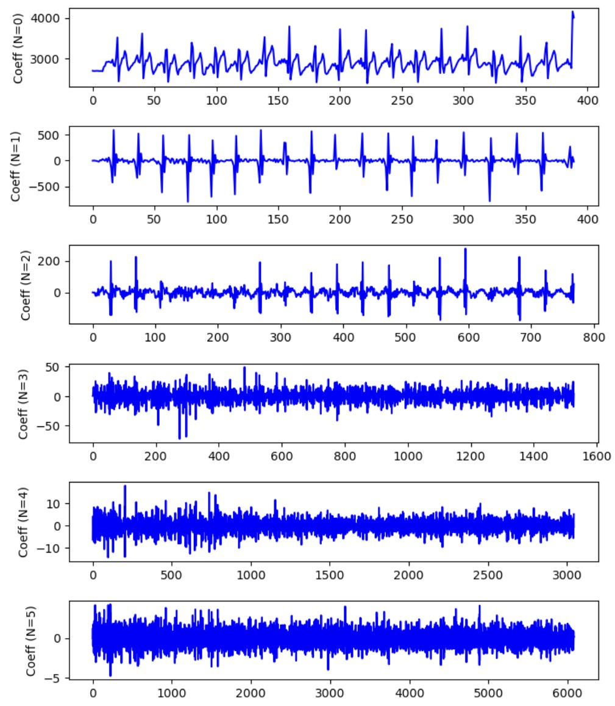
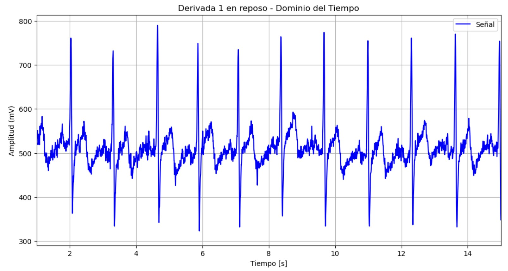
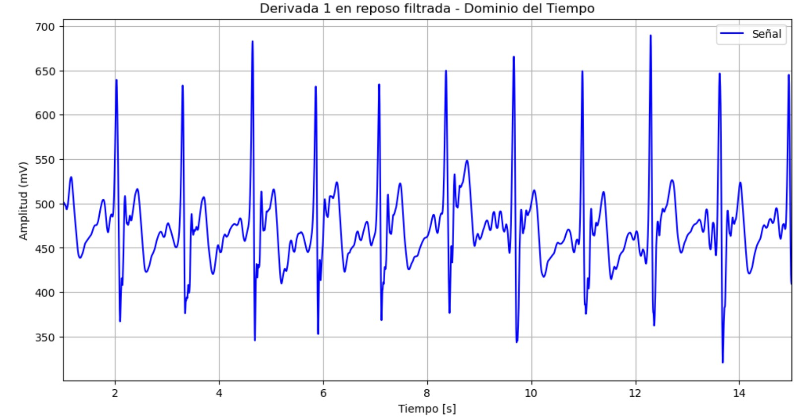
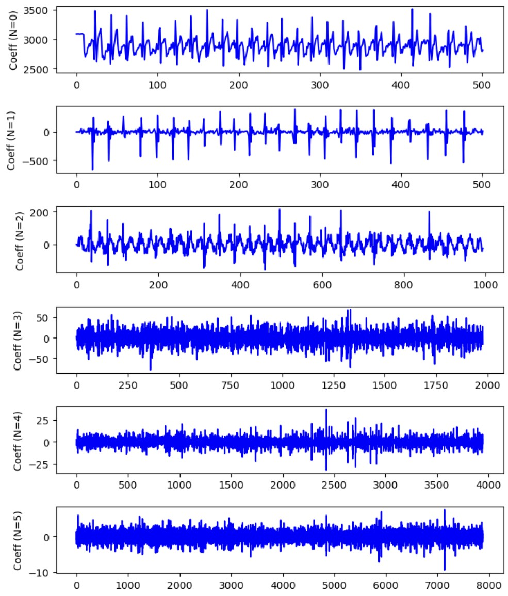
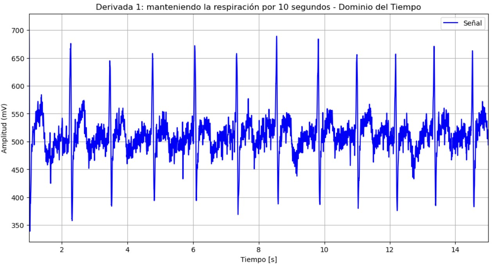
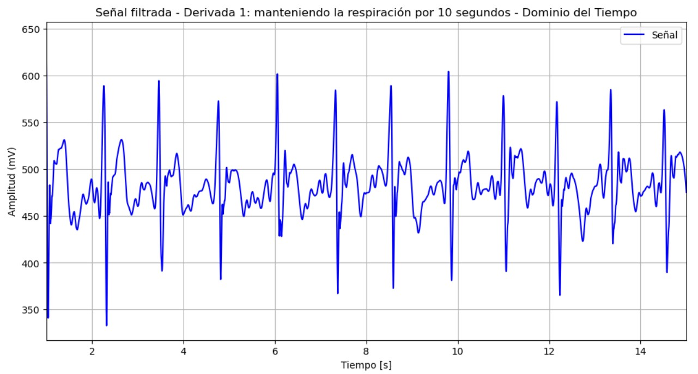
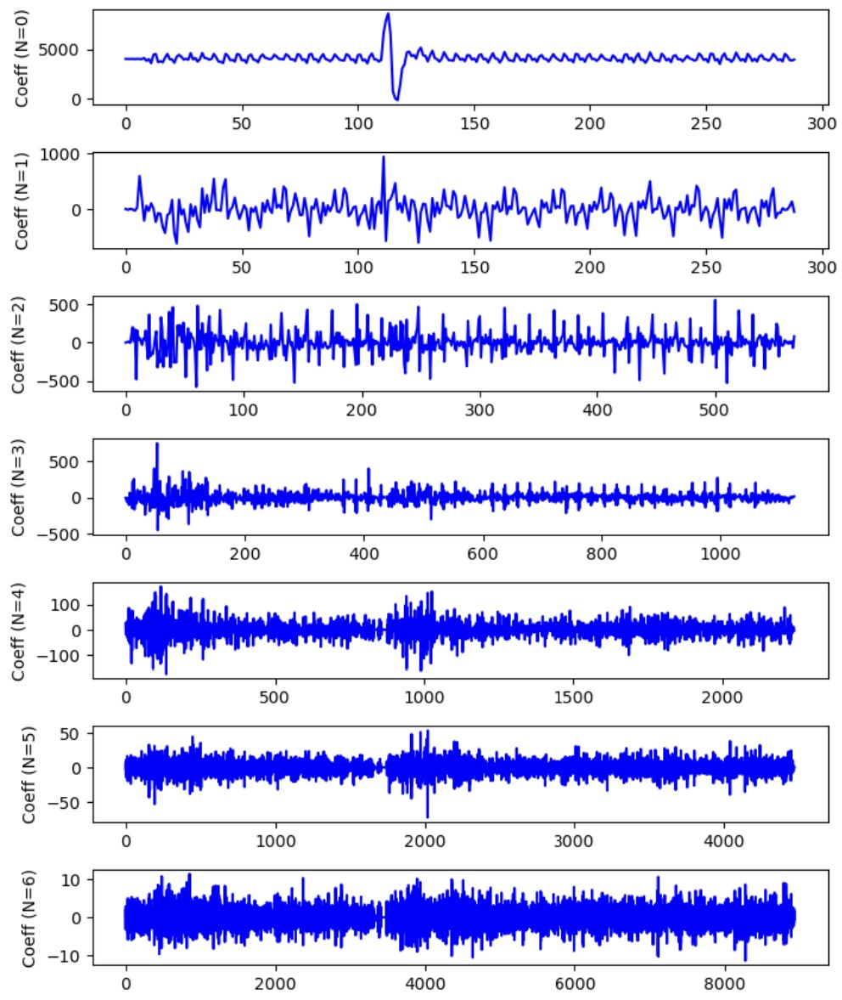
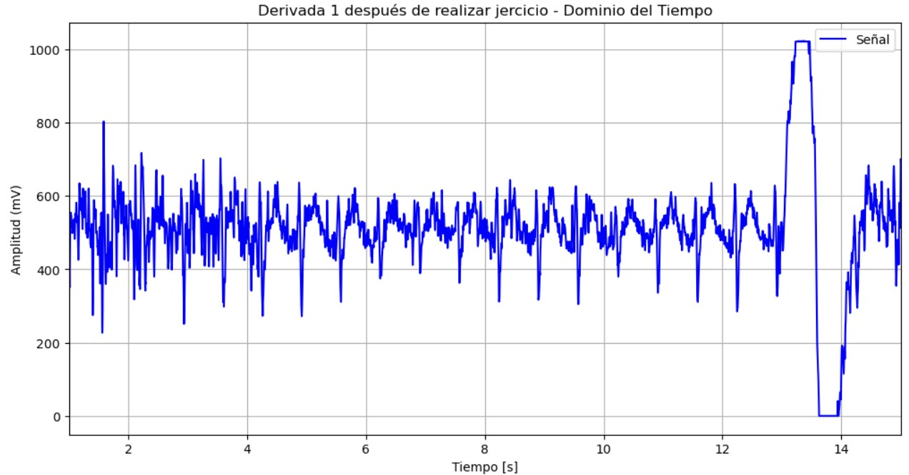
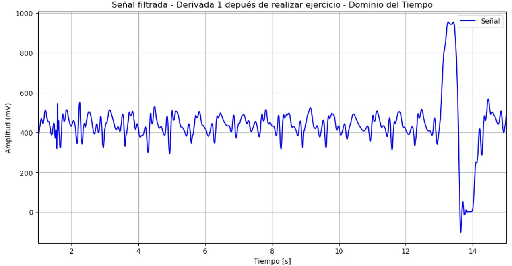

# **LABORATORIO 8: – TRANSFORMADA WAVELET**
# **Tabla de contenidos**

1. [Introducción](#id1)
2. [Objetivos](#id2)
3. [Materiales y equipos](#id3)
4. [Métodología](#id4)
5. [Resultados](#id5)\
   5.1 [Señal ECG](#id6)\
   5.2 [Señal EMG](#id7)\
   5.3 [Señal EEG](#id8)\
   5.4 [Archivos](#id9)
7. [Conclusiones](#id10)
9. [Referencias bibliográficas](#id11)

## **Introducción** 

## **Objetivos** 
* Comprender los conceptos básicos de la transformada wavelet 
* Realizar el filtrado de las señales ECG, EMG y EEG utilizando la transformada wavelet
* Aplicar técnicas de wavelets para el procesamiento de señales enfocándose en la eliminación de ruido y la detección de características importantes

## **Materiales y equipos** 

   
|  **Modelo**  | **Descripción** | **Cantidad** |
|:------------:|:---------------:|:------------:|
|       -      |      Laptop     |       1      |
| - |   Python y librerías  |       -      |

 Tabla 1: Materiales y equipos</i>

## **Metodología** 
- Especificaciones del filtro wavelet para ECG. Para el filtrado de ECG se tómo el siguiente artículo "ECG Signal Denoising Using Wavelet Thresholding Techniques in
Human Stress Assessment" [1]
  - Tipo de wavelet: db4
  - Nivel de descomposición: 6
  - Umbral: soft

- Especificaciones del filtro wavelet para EMG
  - Tipo de wavelet:
  - Nivel de descomposición:
  - Umbral:
    
- Especificaciones del filtro wavelet para EEG
  - Tipo de wavelet:
  - Nivel de descomposición:
  - Umbral:

## **Resultados** 
### **Señal ECG** 
- **Derivación 1: reposo**

Figura 1: Niveles de descomposición</i>

  

   
|  **Señal sin filtrar**  | **Señal filtrada con transformada de Wavelt** |
|:------------:|:---------------:|
|

|

| 

 Tabla 2: Filtrado de señal EMG en reposo</i>

  

- **Derivación 1: manteniendo la respiración por 10 segundos**

Figura 2: Niveles de descomposición</i>

   
|  **Señal sin filtrar**  | **Señal filtrada con transformada de Wavelt** |
|:------------:|:---------------:|
|

|

| 

 Tabla 3: Filtrado de señal EMG cuando se mantiene en reposo</i>

- **Derivación 1: después de una actividad física**

Figura 3: Niveles de descomposición</i>

   
|  **Señal sin filtrar**  | **Señal filtrada con transformada de Wavelt** |
|:------------:|:---------------:|
|

|

| 

 Tabla 4: Filtrado de señal EMG después de actividad física</i>

### **Señal EMG** 

### **Señal EEG** 
   
### **Archivos** 
- [Documentos (.txt)](https://github.com/DianaCortezL/ISB-Grupo-5/tree/88e031b9ee680d6403ba408c9e73f99652f8cca3/Otros/Archivos%20varios)
- [Programa de ploteo ECG (Jupyter Notebook)](https://github.com/DianaCortezL/ISB-Grupo-5/blob/19ff03aa9ecb7bfd3b8092b4e4bf92c544287deb/ISB/Laboratorios/Lab08%20-%20Transformada%20de%20Wavelet/ECG/ECG_wavelet.ipynb)
- [Programa de ploteo EMG (Jupyter Notebook)](https://github.com/DianaCortezL/ISB-Grupo-5/blob/5fef37bacd236676dc3a4800ffb80b7bd5016f02/ISB/Laboratorios/Lab08%20-%20Transformada%20de%20Wavelet/EMG/EMG_wavelet.ipynb)
- [Programa de ploteo EEG (Jupyter Notebook)](https://github.com/DianaCortezL/ISB-Grupo-5/blob/19ff03aa9ecb7bfd3b8092b4e4bf92c544287deb/ISB/Laboratorios/Lab08%20-%20Transformada%20de%20Wavelet/EEG/EEG_code.ipynb)

## **Conclusiones** 
   -

## **Referencias bibliográficas** 
[1] P. Karthikeyan, M. Murugappan, and S. Yaacob, “ECG signal denoising using wavelet thresholding techniques in human stress assessment,” Int. J. Electr. Eng. Inform., vol. 4, no. 2, p. 306, 2012.

[2]

[3] 
 
[4] 
