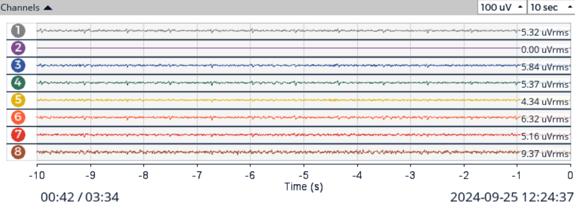
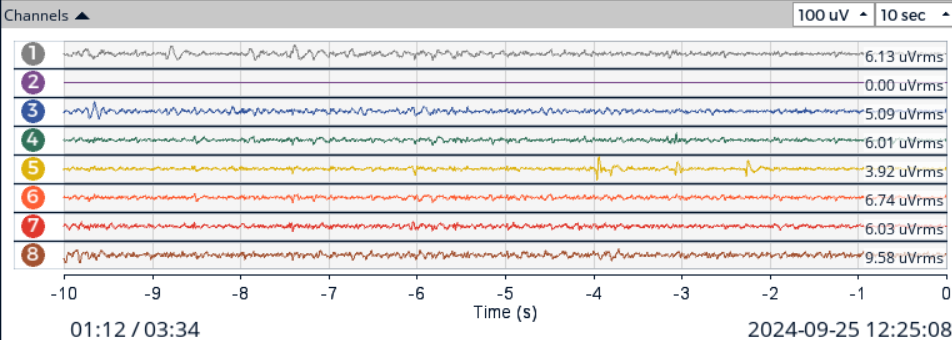
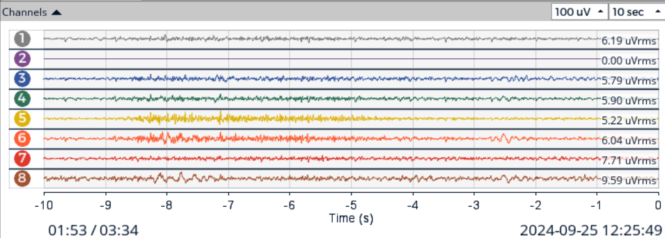
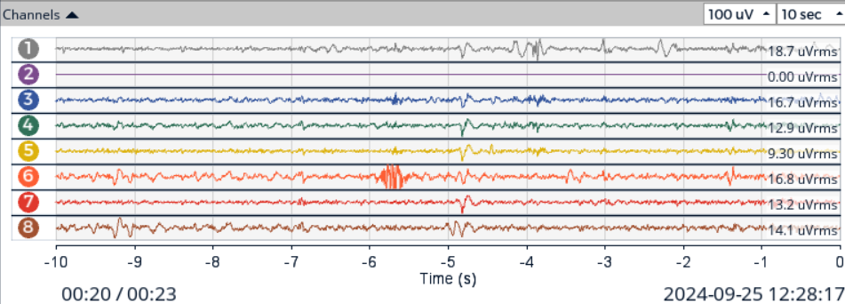

# **LABORATORIO 8: – TRANSFORMADA WAVELET**
# **Tabla de contenidos**

1. [Introducción](#id1)
2. [Objetivos](#id2)
3. [Materiales y equipos](#id3)
4. [Métodología](#id4)
5. [Resultados](#id5)\
   5.1 [Señal ECG](#id6)\
   5.2 [Señal EMG](#id7)\
   5.3 [Señal EEG](#id8)\
   5.4 [Archivos](#id9)
7. [Conclusiones](#id10)
9. [Referencias bibliográficas](#id11)

## **Introducción** 

## **Objetivos** 
* Adquirir señales biomédicas de EEG utilizando el Kit BITalino (R)evolution
* Obtener señales de EEG utilizando Ultracortex Mark IV EEG Headset y la tarjeta de biosensado Cyton de 8 canales.
* Plotear las señales en dominio del tiempo y frecuencia en Python

## **Materiales y equipos** 

   
|  **Modelo**  | **Descripción** | **Cantidad** |
|:------------:|:---------------:|:------------:|
|       -      |      Laptop     |       1      |
| - |   Python y librerías  |       -      |

 Tabla 1: Materiales y equipos</i>

## **Metodología** 

## **Resultados** 
### **Señal ECG** 

### **Señal EMG** 

### **Señal EEG** 

  

 
|                            **Fase**                            |                                      **Gráfico en OpenBCI GUI**                                |
|:--------------------------------------------------------------:|:----------------------------------------------------------------------------------------------:|
|             **Fase de referencia de 30 segundos**              | 

  |
|   **Realizando secuencia de ojos abiertos - ojos cerrados**    | 

     |
|          **Respondiendo preguntas categoría simple**           | 

|
|        **Respondiendo preguntas categoría compleja**           | 

  |

   
### **Archivos** 
- [Documentos (.txt)](https://github.com/DianaCortezL/ISB-Grupo-5/tree/88e031b9ee680d6403ba408c9e73f99652f8cca3/Otros/Archivos%20varios/Lab6_EEG)
- [Programa de ploteo (Jupyter Notebook)](https://github.com/DianaCortezL/ISB-Grupo-5/blob/01dd208ed2c0990ba65ef55da91e29f922fbb739/ISB/Laboratorios/Lab06%20-%20Adquisi%C3%B3n%20de%20se%C3%B1al%20EEG/LabEEG.ipynb)

## **Conclusiones** 
   -

## **Referencias bibliográficas** 

[1]

[2]

[3] 
 
[4] 
