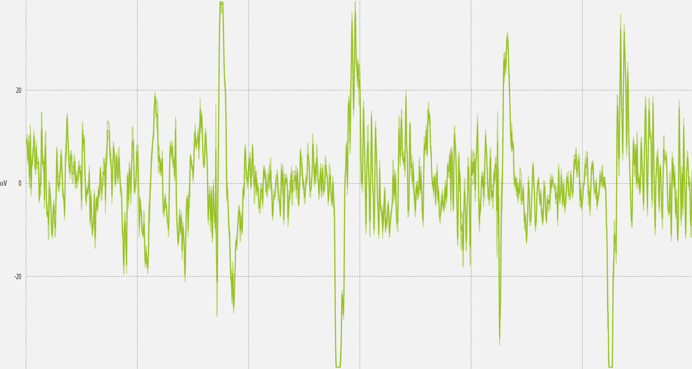
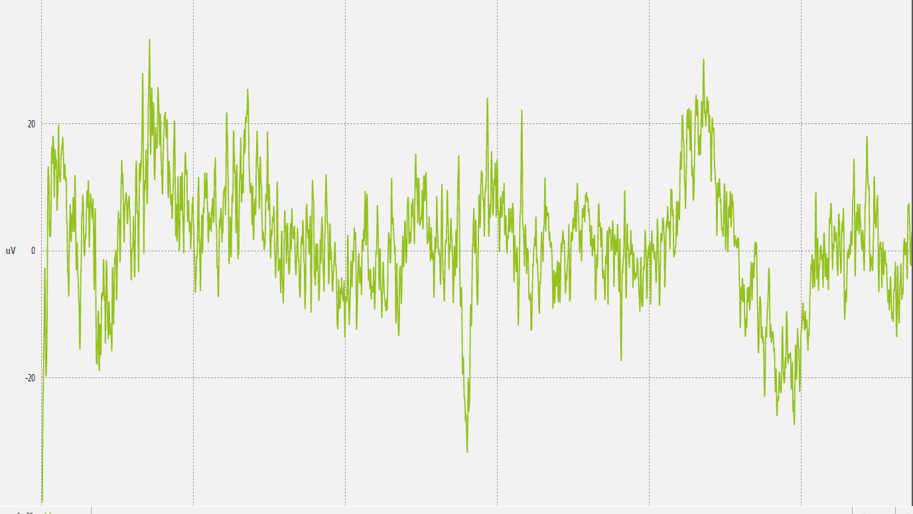
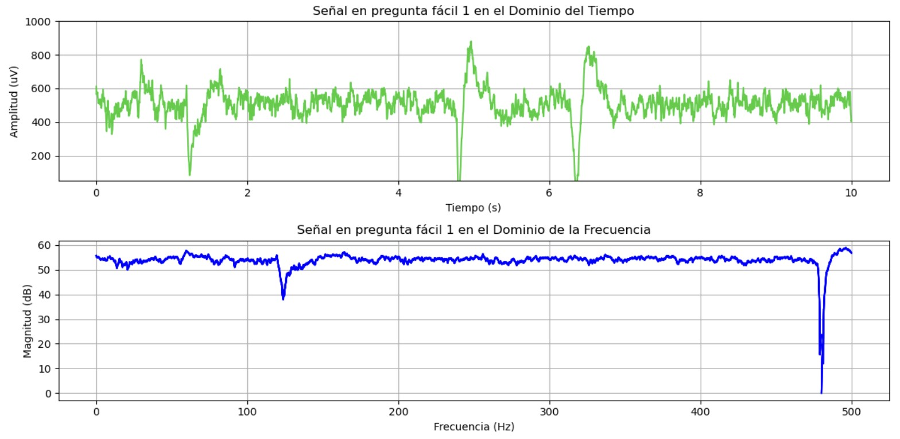
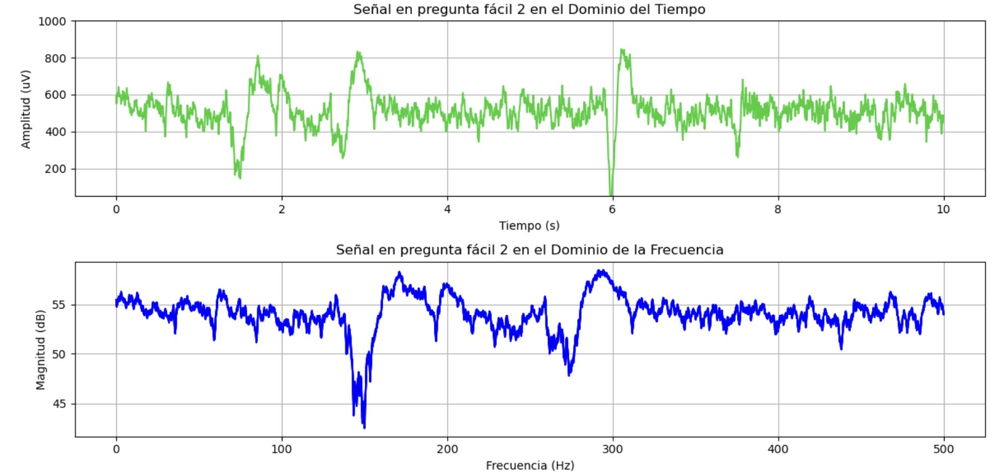

# **LABORATORIO 8: – TRANSFORMADA WAVELET**
# **Tabla de contenidos**

1. [Introducción](#id1)
2. [Objetivos](#id2)
3. [Materiales y equipos](#id3)
4. [Métodología](#id4)
5. [Resultados](#id5)\
   5.1 [Señal ECG](#id6)\
   5.2 [Señal EMG](#id7)\
   5.3 [Señal EEG](#id8)\
   5.4 [Archivos](#id9)
7. [Conclusiones](#id10)
9. [Referencias bibliográficas](#id11)

## **Introducción** 

## **Objetivos** 
* Adquirir señales biomédicas de EEG utilizando el Kit BITalino (R)evolution
* Obtener señales de EEG utilizando Ultracortex Mark IV EEG Headset y la tarjeta de biosensado Cyton de 8 canales.
* Plotear las señales en dominio del tiempo y frecuencia en Python

## **Materiales y equipos** 

   
|  **Modelo**  | **Descripción** | **Cantidad** |
|:------------:|:---------------:|:------------:|
| (R)EVOLUTION |   Kit BITalino  |       1      |
|       -      |      Laptop     |       1      |
|       -      |    Electrodos   |       3      |
|    OpenBCI   |    Ultracortex Mark IV EEG Headset   |       1      |
|    OpenBCI   |   OpenBCI Cyton 8-channel Board   |       1      |

 Tabla 1: Materiales y equipos</i>

## **Metodología** 

## **Resultados** 
### **Señal con OpenBCI Ultracortex "Mark IV"** 
- ### **Gráficos en OpenBCI GUI**
  

 
|                            **Fase**                            |                                      **Gráfico en OpenBCI GUI**                                |
|:--------------------------------------------------------------:|:----------------------------------------------------------------------------------------------:|
|             **Fase de referencia de 30 segundos**              | 

  |
|   **Realizando secuencia de ojos abiertos - ojos cerrados**    | 

     |
|          **Respondiendo preguntas categoría simple**           | 

|
|        **Respondiendo preguntas categoría compleja**           | 

  |

- ### **Discusión de las señales obtenidas en OpenBCI GUI**

### **Señal con BITalino** 
- ### **Gráficos en OpenSignals**
A continuacion mostraremos los graficos ploteados en Open Signals.

 
|         **Fase**                                              |                       **Gráfico en OpenSignals**                      |
|:-------------------------------------------------------------:|:---------------------------------------------------------------------:|
|  **Fase de referencia de 30 segundos**                        | 

|  **Realizando secuencia de ojos abiertos - ojos cerrados**    | 

|  **Respondiendo preguntas categoría simple**                  | 

|  **Respondiendo preguntas categoría compleja**                | 

|

- ### **Gráficos en Python**
Asimismo, se realizo el ploteo de las señales de OpenSignals en Python. Se graficó en dominio del tiempo y de frecuencia

   **1. Línea base 1 de la señal EEG con poco ruido y sin movimientos**

Figura 7: Señal EEG en dominio de tiempo y freciencia de un ciclo sin movimientos oculares y con los ojos cerrados</i>

   2. Señal EEG repitiendo 5 ciclos de 10 segundos de ojos abiertos - ojos cerrados

Figura 8: Señal EEG en dominio de tiempo y frecuencia de un ciclo de ojos abiertos y ojos cerrados</i>

   **3. Línea base 2 de la señal EEG con poco ruido y sin movimientos**

Figura 9: Señal EEG en dominio de tiempo y freciencia de un ciclo sin movimientos oculares y con los ojos cerrados</i>

  **4. Señal completa de EEG durante sesion de preguntas fáciles**\
A continuación, se muestran las señale ploteadas en Python de las 3 preguntas fáciles que se le realizó al sujeto. Se muestran en el dominio del tiempo y frecuencia

Figura 10: Señal EEG en dominio de tiempo y frecuencia durante pregunta fácil 1</i>

Figura 11: Señal EEG en dominio de tiempo y frecuencia durante pregunta fácil 2</i>

Figura 12: Señal EEG en dominio de tiempo y frecuencia durante pregunta fácil 3</i>

  **5. Señal completa de EEG durante sesion de preguntas difíciles**\
A continuación, se muestran las señale ploteadas en Python de las 3 preguntas difíciles que se le realizó al sujeto. Se muestran en el dominio del tiempo y frecuencia

Figura 13: Señal EEG en dominio de tiempo y frecuencia durante pregunta difícil 1</i>

Figura 14: Señal EEG en dominio de tiempo y frecuencia durante pregunta difícil 2</i>

Figura 15: Señal EEG en dominio de tiempo y frecuencia durante pregunta difícil 3</i>

- ### **Discusión de las señales obtenidas con el BITalino**
  1. Al observar las gráficas notamos que para la señal obtenidas durante la fase de reposo (sin movimientos oculares y con los ojos cerrados) notamos un amplitud reducida en comparación a las demás señales y no notamos picos que muy prominentes.Notamos ondas alfa que indican un estado de relajación.
  2. En las señales del ciclo de ojos abiertos - ojos cerrados se distinguen de forma clara picos en el dominio del tiempo que coincide con los momentos en lo que se le pidió a la persona que abra o cierre los ojos (hay un varíacion en ka amplitud de la señal).
  3. Durante las preguntas observamos un aumento de frecuencia en la señal lo que indicaría que el sujeto ha estado sometido a un estrés mental al tratar de responder ejercicios matemáticos.
  4. En las señales de preguntas, notamos una clara diferencia entre las señales tomandas cuando se realizaban preguntas fáciles y difícles. En las preguntas difíciles se observa un aumento de la actividad cerebral marcado por picos prominentes y más frecuentes. Notamos ondas beta que se presentan durante la actividad mental y al estrés al tratar de responder preguntas matemáticas.

   
### **Archivos** 
- [Documentos (.txt)](https://github.com/DianaCortezL/ISB-Grupo-5/tree/88e031b9ee680d6403ba408c9e73f99652f8cca3/Otros/Archivos%20varios/Lab6_EEG)
- [Programa de ploteo (Jupyter Notebook)](https://github.com/DianaCortezL/ISB-Grupo-5/blob/01dd208ed2c0990ba65ef55da91e29f922fbb739/ISB/Laboratorios/Lab06%20-%20Adquisi%C3%B3n%20de%20se%C3%B1al%20EEG/LabEEG.ipynb)

## **Conclusiones** 
   - En cuanto al BITalino, durante la fase de ojo abiertos - ojos cerrados se observa claramente un cambio en la amplitud de la señal (picos significativos) en el tiempo lo que indica que el sujeto abrió los ojos y puede estar relacionado a una excitación del sistema visual y disminución de la actividad de la ondas alpha.
   - El EEG muestra patrones claros de la actividad cerebral en función del estado del sujeto. La relajación se manifiesta a través de ondas alpha en ojos cerrados, mientras que la actividad mental y el estrés cognitivo se reflejan en ondas beta durante la resolución de preguntas, especialmente cuando las preguntas son más complejas. Las variaciones en la amplitud y frecuencia son indicativas de los diferentes niveles de procesamiento y esfuerzo mental en cada situación.

## **Recomendaciones** 
   - Dado que la toma de las señales EEG se realizó en un ambiente que no era el más apropiado debido a la existencia de mucho ruido y luz, los resultados obtenidos no podrían ser óptimos. Para futuras experiencias sería recomendable realizar la toma de datos en sitios más tranquilo y aplicar técnicas de filtrado para poder mejorar la visualización de las señales y eliminar el ruido. 

## **Referencias bibliográficas** 

[1] “Electroencefalografía (EEG) - Mayo Clinic,” Mayoclinic.org, 2024. https://www.mayoclinic.org/es/tests-procedures/eeg/about/pac-20393875 (accessed Sep. 28, 2024).

[2] C. Clinic, “EEGs (electroencephalograms) are tests that evaluate brain function. Healthcare providers order EEGs to diagnose brain issues like epilepsy or dementia.,” Cleveland Clinic, Nov. 16, 2016. https://my.clevelandclinic.org/health/diagnostics/9656-electroencephalogram-eeg (accessed Sep. 28, 2024).

[3] Neurofeedback, “¿Qué son las ondas Cerebrales? - NeuroFeedBack Barcelona,” NeuroFeedBack Barcelona, Jul. 24, 2019. https://www.neurofeedback.cat/que-son-las-ondas-cerebrales/ (accessed Sep. 28, 2024).  
 
[4] BITalino, “BITalino HOME-GUIDE #3 ELECTROENCEPHALOGRAPHY (EEG) Exploring Brain signals” 2020 Accessed: Sep. 28, 2024. [Online]. Available from:ht
