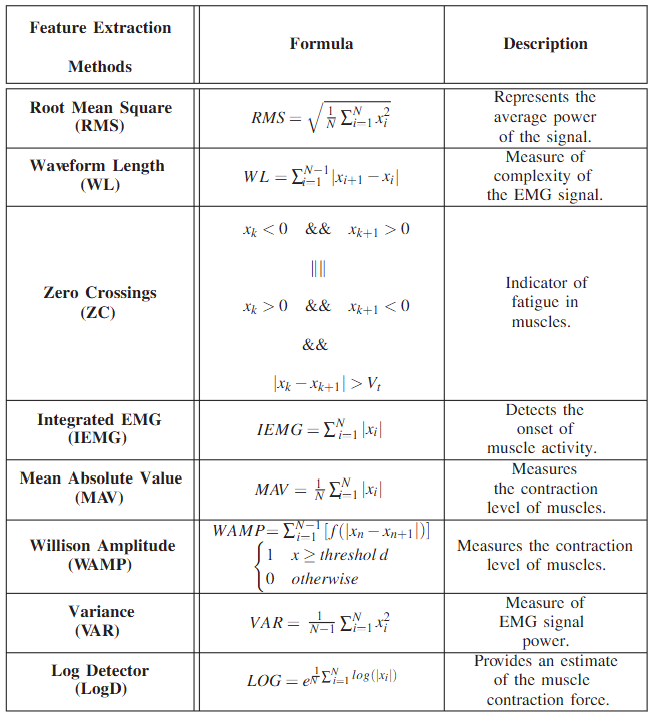

# **LABORATORIO 9: PROCESAMIENTO DE SEÑAL EMG**
# **Tabla de contenidos**

1. [Introducción](#id1)
2. [Objetivos](#id2)
3. [Materiales y equipos](#id3)
4. [Métodología](#id4)
5. [Resultados](#id5)
6. [Conclusiones](#id6)
7. [Referencias bibliográficas](#id7)

## **Introducción** 
El procesamiento de señales electromiográficas (EMG) es fundamental en el análisis de la actividad muscular, ya que permite interpretar las señales eléctricas generadas durante la contracción muscular. Estas señales, capturadas mediante electrodos colocados sobre la piel o insertados en el músculo, contienen información clave sobre el estado y el comportamiento de los músculos, siendo ampliamente utilizadas en aplicaciones como la rehabilitación física, el control de prótesis, y la investigación de la fatiga muscular. El procesamiento de las señales EMG implica varias etapas, entre las cuales se incluyen la eliminación de ruido, la segmentación y la extracción de características. El objetivo de procesar y segmentar la señal EMG es adaptarla para su posterior análisis, eliminando el ruido que podría llevar a interpretaciones erróneas.

Una de las principales dificultades en el procesamiento de señales EMG es la presencia de ruido, el cual puede ser generado por diversas fuentes, como el movimiento del sujeto, la actividad cardíaca y las interferencias eléctricas. El uso de filtros es uno de los métodos más efectivos para reducir el ruido de una señal, mejorando su fidelidad. Entre los filtros comúnmente utilizados están los filtros IR y FIR, que ayudan a atenuar frecuencias no deseadas. Además, el uso de métodos basados en wavelets permite descomponer la señal en diferentes niveles de frecuencia, proporcionando una herramienta poderosa para el análisis y filtrado de señales EMG en presencia de ruido de múltiples frecuencias.

La segmentación de la señal es otra etapa crítica, en la cual la señal EMG se divide en intervalos específicos para su análisis. Esto permite identificar patrones de activación muscular en determinados periodos de tiempo, lo cual es esencial en estudios que requieren análisis en tiempo real o que buscan correlacionar actividades musculares con eventos específicos, como en el análisis de la marcha o la detección de movimientos. La longitud de la ventana determina la cantidad de información que se utiliza para la extracción y la clasificación: más datos producirán mejores resultados a costa de aumentar el tiempo de procesamiento del clasificador. Por ejemplo, Englehart et al. obtuvo los mejores resultados para un tiempo de ventana igual a 32 milisegundos. Por otro lado, Phinyomark eta al. determinó que longitudes de segmento entre 125 a 500 ms aumenta significativamente la precisión de la clasificación al reducir el sesgo y la varianza en las característicad calculadas [2].

Finalmente, la extracción de características en la señal EMG es esencial para obtener métricas relevantes que describan el comportamiento muscular, clasificar la actividad muscular, detectar patologías o evaluar el rendimiento muscular en diversas condiciones. Las características extraídas podrían clasificarse en dominios de tiempo o frecuencia. Las características del dominio de tiempo representan la energía de una señal EMG. Por otro lado, las características del dominio de frecuencia, además de mostrar el nivel de activación de los músculos, tienen la capacidad de eliminar el ruido de la señal pero tienen un mayor costo computacional. Algunas de las características más importantes del dominio del tiempo son EMG integrada (IEMG), valor absoluto medio (MAV), raíz cuadrada mediana (RMS), integral cuadrada simple (SSI) o longitud de forma de onda (WL). Las características del dominio de frecuencia se utilizan generalmente para el estudio de la fatiga muscular o en el análisis de la unidad motora, siendo no apropiadas para la clasificación de señales EMG. Algunas de las características más importantes del dominio de frecuencia son frecuencia media (MNF), frecuencia mediana (MDF), frecuencia de potencia media (MNP), frecuencia de pico (PKF) o potencia total (TTP) [3]

Figura 1: Resumen de características y fórmulas de la señal EMG [4]</i>

  
## **Objetivos** 
* Filtrar señales EMG e identificar el mejor filtro
* Extraer y evaluar características importantes de las señales EMG

## **Materiales y equipos** 

   
|  **Modelo**  | **Descripción** | **Cantidad** |
|:------------:|:---------------:|:------------:|
|       -      |      Laptop     |       1      |
| - |   Python y librerías  |       -      |
| - |   Visual Studio Code  |       -      |

 Tabla 1: Materiales y equipos</i>

## **Metodología** 

## **Resultados** 

Figura 1: Niveles de descomposición</i>

  

   
|  **Señal sin filtrar**  | **Señal filtrada con transformada de Wavelt** |
|:------------:|:---------------:|
|

|

| 

 Tabla 2: Filtrado de señal EMG en reposo</i>

  

### **Archivos** 
- [Documentos (.txt)](https://github.com/DianaCortezL/ISB-Grupo-5/tree/88e031b9ee680d6403ba408c9e73f99652f8cca3/Otros/Archivos%20varios)
- [Procesamiento ECG (Jupyter Notebook)](https://github.com/DianaCortezL/ISB-Grupo-5/blob/19ff03aa9ecb7bfd3b8092b4e4bf92c544287deb/ISB/Laboratorios/Lab08%20-%20Transformada%20de%20Wavelet/ECG/ECG_wavelet.ipynb)

## **Conclusiones** <a name="id6">
   - 
   - 
   - 

## **Referencias bibliográficas** 
[1] Englehart, K.; Hudgins, B. A Robust, Real-Time Control Scheme for Multifunction Myoelectric Control. IEEE Trans. Biomed. Eng. 2003, 50, 848–854.

[2] A. Phinyomark, F. Quaine, S. Charbonnier, C. Serviere, F. Tarpin-Bernard, and Y. Laurillau, “EMG feature evaluation for improvingmyoelectric pattern recognition robustness,” Expert Systems with ap-plications, vol. 40, no. 12, pp. 4832–4840, 2013
 
[3] del Olmo, Manuel, and Rosario Domingo. “EMG Characterization and Processing in Production Engineering.” Materials, vol. 13, no. 24, 20 Dec. 2020, p. 5815, https://doi.org/10.3390/ma13245815.

