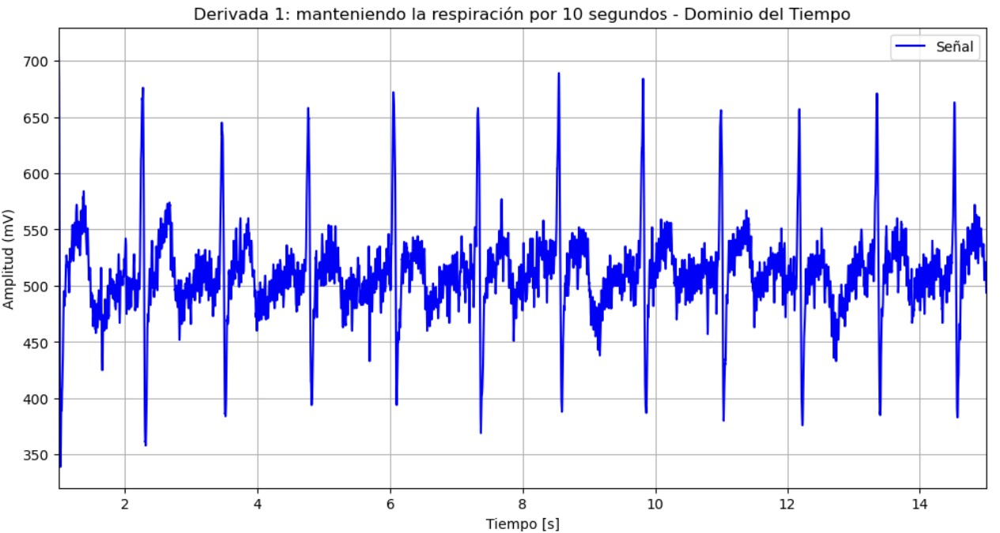
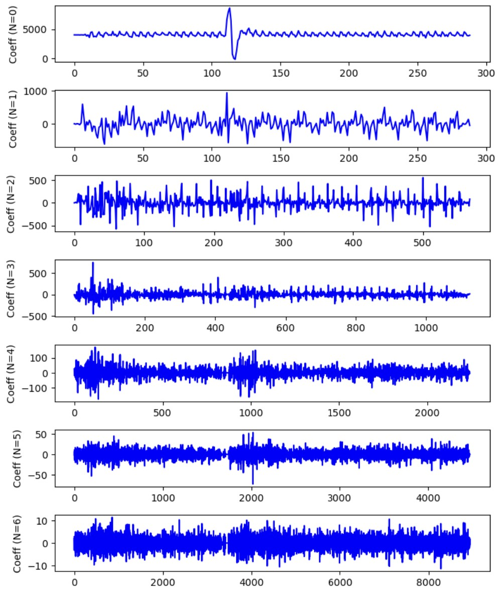

# **LABORATORIO 9: – PROCESAMIENTO DE SEÑAL EMG**
# **Tabla de contenidos**

1. [Introducción](#id1)
2. [Objetivos](#id2)
3. [Materiales y equipos](#id3)
4. [Métodología](#id4)
5. [Resultados](#id5)\
   5.1 [Señal ECG](#id6)\
   5.2 [Señal EMG](#id7)\
   5.3 [Señal EEG](#id8)\
   5.4 [Archivos](#id9)
7. [Conclusiones](#id10)
9. [Referencias bibliográficas](#id11)

## **Introducción** 

## **Objetivos** 
* 
* 
* 

## **Materiales y equipos** 

   
|  **Modelo**  | **Descripción** | **Cantidad** |
|:------------:|:---------------:|:------------:|
|       -      |      Laptop     |       1      |
| - |   Python y librerías  |       -      |

 Tabla 1: Materiales y equipos</i>

## **Metodología** 

## **Resultados** 
### **Señal ECG** 
- **Derivación 1: reposo**

Figura 1: Niveles de descomposición</i>

  

   
|  **Señal sin filtrar**  | **Señal filtrada con transformada de Wavelt** |
|:------------:|:---------------:|
|

|

| 

 Tabla 2: Filtrado de señal EMG en reposo</i>

  

- **Derivación 1: manteniendo la respiración por 10 segundos**

Figura 2: Niveles de descomposición</i>

   
|  **Señal sin filtrar**  | **Señal filtrada con transformada de Wavelt** |
|:------------:|:---------------:|
|

|

| 

 Tabla 3: Filtrado de señal EMG cuando se mantiene en reposo</i>

- **Derivación 1: después de una actividad física**

Figura 3: Niveles de descomposición</i>

   
|  **Señal sin filtrar**  | **Señal filtrada con transformada de Wavelt** |
|:------------:|:---------------:|
|

|

| 

 Tabla 4: Filtrado de señal EMG después de actividad física</i>

En la actividad 1 y 2 (reposo y manteniendo respiración) notamos de forma clara como la transformada de wavelet permite obtener una señal con menos ruido y manteniendo los picos P, T y el complejo QRS. Además, este método permite la eliminación de componentes de alta frecuencia que pueden corresponder a artefactos, ruido o red eleéctrica. Notamos que al reconstruir la señal se obtiene una más suave y sin mucho ruido. Los niveles 5 al 3 capturan principalmente ruido, que es eliminado luego de la umbralización. Los niveles 2 al 0 capturan detalles importantes y algunos artefactos. 

En el último nivel de descomposición (N=6), los coeficientes capturan principalmente las frecuencias más altas de la señal original, lo que incluye una gran cantidad de ruido. A medida que se avanza a los niveles N=5 y N=4, los coeficientes siguen reflejando componentes de alta frecuencia, aunque con una menor cantidad de ruido, permitiendo que los picos QRS aún sean visibles. En los niveles intermedios (N=3 a N=2), los coeficientes comienzan a representar mejor las variaciones de baja frecuencia, lo que reduce aún más el ruido y destaca las características globales de la señal. A partir del nivel N=1, se capturan las tendencias más suaves y de muy baja frecuencia, con un menor nivel de ruido y una mayor claridad en los detalles finos de la señal. Finalmente, en el nivel N=0, predomina las variaciones de muy baja frecuencia, mostrando las tendencias generales de la señal original.

### **Señal EMG** 
- Tricep en sobreesfuerzo:

Figura 4: Niveles de descomposición (10)</i>

  

   
|  **Señal sin filtrar**  | **Señal filtrada con transformada de Wavelt** |
|:------------:|:---------------:|
|

|

| 

 Tabla 3: Filtrado de señal EMG en sobreefuerzo</i>

  

### **Señal EEG** 
   
### **Archivos** 
- [Documentos (.txt)](https://github.com/DianaCortezL/ISB-Grupo-5/tree/88e031b9ee680d6403ba408c9e73f99652f8cca3/Otros/Archivos%20varios)
- [Programa de ploteo ECG (Jupyter Notebook)](https://github.com/DianaCortezL/ISB-Grupo-5/blob/19ff03aa9ecb7bfd3b8092b4e4bf92c544287deb/ISB/Laboratorios/Lab08%20-%20Transformada%20de%20Wavelet/ECG/ECG_wavelet.ipynb)
- [Programa de ploteo EMG (Jupyter Notebook)](https://github.com/DianaCortezL/ISB-Grupo-5/blob/5fef37bacd236676dc3a4800ffb80b7bd5016f02/ISB/Laboratorios/Lab08%20-%20Transformada%20de%20Wavelet/EMG/EMG_wavelet.ipynb)
- [Programa de ploteo EEG (Jupyter Notebook)](https://github.com/DianaCortezL/ISB-Grupo-5/blob/19ff03aa9ecb7bfd3b8092b4e4bf92c544287deb/ISB/Laboratorios/Lab08%20-%20Transformada%20de%20Wavelet/EEG/EEG_code.ipynb)

## **Conclusiones** 
   - Se empleó correctamente la transformada wavelet para cada tipo de señal biomédica, esta transformada tomó los parámetros acorde a cada artículo referenciado.
   - Se realizó una búsqueda detalla de artículos, donde se definían los parámetros adecuados para el filtrado de cada tipo de señal.
   - Se demostró la diferencia entre la señal original y la señal filtrada, dando como resultado una señal mucho más limpia de ruido.

## **Referencias bibliográficas** 
[1] P. Karthikeyan, M. Murugappan, and S. Yaacob, “ECG signal denoising using wavelet thresholding techniques in human stress assessment,” Int. J. Electr. Eng. Inform., vol. 4, no. 2, p. 306, 2012.

[2] X. Zhang, Y. Liu, and Z. Li, “An improved wavelet threshold denoising approach for surface electromyography signal,” *EURASIP J. Adv. Signal Process.*, vol. 2020, no. 1, p. 12, 2020.

[3] 
 
[4] 

