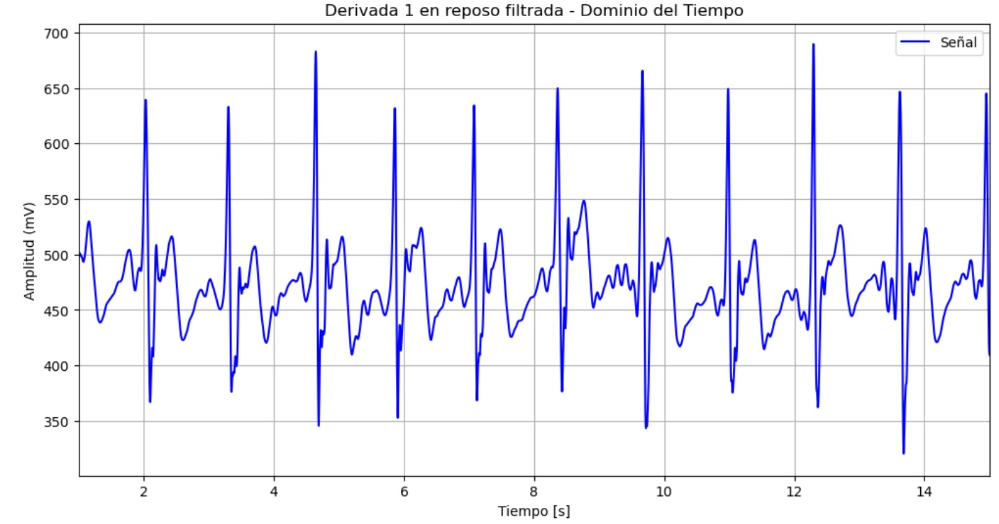

# **LABORATORIO 9: PROCESAMIENTO DE SEÑAL EMG**
# **Tabla de contenidos**

1. [Introducción](#id1)
2. [Objetivos](#id2)
3. [Materiales y equipos](#id3)
4. [Métodología](#id4)
5. [Resultados](#id5)
6. [Conclusiones](#id6)
7. [Referencias bibliográficas](#id7)

## **Introducción** 

## **Objetivos** 
* Filtrar señales EMG e identificar el mejor filtro
* Extraer y evaluar características importantes de las señales EMG

## **Materiales y equipos** 

   
|  **Modelo**  | **Descripción** | **Cantidad** |
|:------------:|:---------------:|:------------:|
|       -      |      Laptop     |       1      |
| - |   Python y librerías  |       -      |
| - |   Visual Studio Code  |       -      |

 Tabla 1: Materiales y equipos</i>

## **Metodología** 

## **Resultados** 

Figura 1: Niveles de descomposición</i>

  

   
|  **Señal sin filtrar**  | **Señal filtrada con transformada de Wavelt** |
|:------------:|:---------------:|
|

|

| 

 Tabla 2: Filtrado de señal EMG en reposo</i>

  

### **Archivos** 
- [Documentos (.txt)](https://github.com/DianaCortezL/ISB-Grupo-5/tree/88e031b9ee680d6403ba408c9e73f99652f8cca3/Otros/Archivos%20varios)
- [Procesamiento ECG (Jupyter Notebook)](https://github.com/DianaCortezL/ISB-Grupo-5/blob/19ff03aa9ecb7bfd3b8092b4e4bf92c544287deb/ISB/Laboratorios/Lab08%20-%20Transformada%20de%20Wavelet/ECG/ECG_wavelet.ipynb)

## **Conclusiones** <a name="id6">
   - 
   - 
   - 
## **Referencias bibliográficas** 
[1] 

[2] 
 
[4] 

