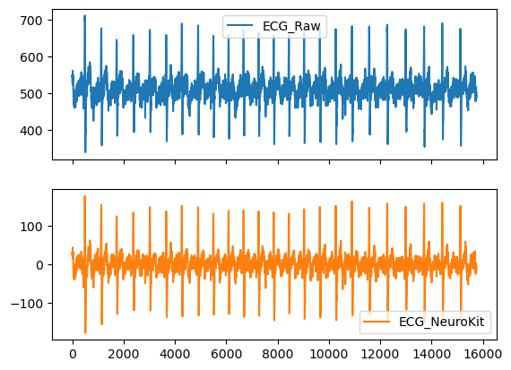

# **LABORATORIO 10: PROCESAMIENTO DE SEÑAL ECG**
# **Tabla de contenidos**

1. [Introducción](#id1)
2. [Objetivos](#id2)
3. [Materiales y equipos](#id3)
4. [Métodología](#id4)
5. [Resultados](#id5)
6. [Conclusiones](#id6)
7. [Referencias bibliográficas](#id7)

## **Introducción** 
  
## **Objetivos** 
* Filtrar, procesar y analizar la señal ECG usando la librería Neurokit2
* Extraer y evaluar características importantes de las señales ECG
* Identificar los picos R y hallar el HRV (variabilidad de la frecuencia cardiaca)

## **Materiales y equipos** 

   
|  **Modelo**  | **Descripción** | **Cantidad** |
|:------------:|:---------------:|:------------:|
|       -      |      Laptop     |       1      |
| - |   Python y librerías (Neurokit2)  |       -      |
| - |   Visual Studio Code  |       -      |

 Tabla 1: Materiales y equipos</i>

## **Metodología** 

## **Resultados** 
**Reposo (Derivación Bipolar I)**
  - **Pre-procesamiento de la señal: ecg_clean()**  

Figura 1: Filtrado de la señal ECG en reposo usando la función ecg_clean()</i>

  - **Análisis**\
    a. ecg_process()
    

    

    
Figura 2: Análisis de la señal ECG en reposo usando la función ecg_process()</i>

    

  
    b. ecg_analyze()

    c. Identificación de picos R
    

    

    
Figura 3: Identifiación de picos R en reposo usando la función ecg_peaks()</i>

    

  - **Ploteo de la señal ECG usando ecg_plot()**
    

    

    
Figura 4: Ploeto de la señal ECG en reposo usando la función ecg_plot() de Neurokit2</i>

    

    

    

    
Figura 5: Señal ECG en papel para electrocardiagrama</i>

    

**Manteniendo la respiración por 10 segundos (Derivación Bipolar I)**
  - **Pre-procesamiento de la señal: ecg_clean()**

Figura 6: Filtrado de la señal ECG mientras se mantiene la respiración usando la función ecg_clean()</i>

    
- **Análisis**\
    a. ecg_process()
    

    

    
Figura 7:Análisis de la señal ECG mientras se mantiene la respiración usando la función ecg_process()</i>

    

  
    b. ecg_analyze()
  
    c. Identificación de picos R
    

    

    
Figura 8: Identifiación de picos R de la señal ECG mientras se mantiene la respiración usando la función ecg_peaks()</i>

    

- **Ploteo de la señal ECG usando ecg_plot()**
    

    

    
Figura 9: Ploteo señal ECG mientras se mantiene la respiración usando la función ecg_plot()</i>

    

    

    

    
Figura 10: Señal ECG en papel para electrocardiagrama</i>

    

**Después de una actividad física (Derivación Bipolar I)**
  - **Pre-procesamiento de la señal: ecg_clean()**

Figura 11: Filtrado de la señal ECG después de una actividad física usando la función ecg_clean()</i>

    
- **Análisis**\
    a. ecg_process()
    

    

    
Figura 12: Filtrado de la señal ECG después de una actividad física usando la función ecg_process()</i>

    

  
    b. ecg_analyze()

    c. Identificación de picos R
    

    

    
Figura 13: Identifiación de picos de la señal ECG después de una actividad física usando la función ecg_peaks()</i>

    

- **Ploteo de la señal ECG usando ecg_plot()**
     

    

    
Figura 14: Ploteo señal ECG después de una actividad física usando la función ecg_plot()</i>

    

    
    

    

    
Figura 15: Señal ECG en papel para electrocardiagrama</i>

    

## **Discusión**

## **Conclusiones** <a name="id6">
   - 
   - 
   - 

## **Archivos** 
- [Documentos (.txt)](https://github.com/DianaCortezL/ISB-Grupo-5/tree/7c6ef550649274b69b6c0ab7dcd442e831e8bcb9/Otros/Archivos_varios/Lab5_ECG)
- [Procesamiento ECG (Reposo)](https://github.com/DianaCortezL/ISB-Grupo-5/blob/61c077b132e80fc61da74c910ea39de3dd4c005c/ISB/Laboratorios/Lab10%20-%20Procesamiento%20de%20ECG/nuevodelnuevo.ipynb)
- [Procesamiento ECG (Manteniendo respiración)](https://github.com/DianaCortezL/ISB-Grupo-5/blob/61c077b132e80fc61da74c910ea39de3dd4c005c/ISB/Laboratorios/Lab10%20-%20Procesamiento%20de%20ECG/ManteniedoRespiracionD1.ipynb)
- [Procesamiento ECG (Después de ejercicio)](https://github.com/DianaCortezL/ISB-Grupo-5/blob/61c077b132e80fc61da74c910ea39de3dd4c005c/ISB/Laboratorios/Lab10%20-%20Procesamiento%20de%20ECG/EjercicioD1.ipynb)

## **Referencias bibliográficas** 
[1] 

[2] 
 
[3] 

[4]
