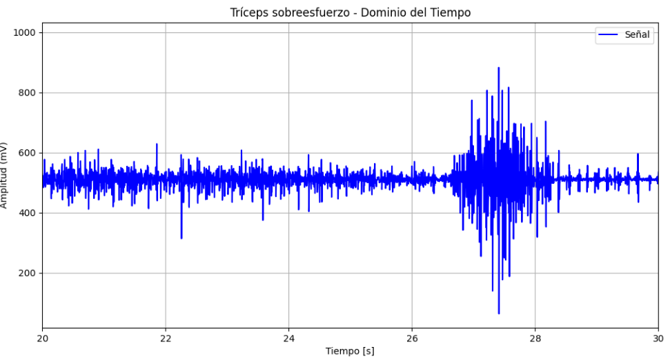

# **LABORATORIO 9: PROCESAMIENTO DE SEÑAL ECG**
# **Tabla de contenidos**

1. [Introducción](#id1)
2. [Objetivos](#id2)
3. [Materiales y equipos](#id3)
4. [Métodología](#id4)
5. [Resultados](#id5)
6. [Conclusiones](#id6)
7. [Referencias bibliográficas](#id7)

## **Introducción** 
  
## **Objetivos** 
* Filtrar, procesar y analizar la señal ECG usando la librería Neurokit2
* Extraer y evaluar características importantes de las señales ECG
* Identificar los picos R y hallar el HRV (variabilidad de la frecuencia cardiaca)

## **Materiales y equipos** 

   
|  **Modelo**  | **Descripción** | **Cantidad** |
|:------------:|:---------------:|:------------:|
|       -      |      Laptop     |       1      |
| - |   Python y librerías (Neurokit2)  |       -      |
| - |   Visual Studio Code  |       -      |

 Tabla 2: Materiales y equipos</i>

## **Metodología** 

## **Resultados** 
1. **Estado Basal (Derivación Bipolar I)**
  - **Pre-procesamiento de la señal: ecg_clean()**
    
  - **Análisis**\
    a. ecg_process()

    b. ecg_analyze()

    c. Identificación de picos R
    
  - **Ploteo de la señal ECG usnando ecg_plot()**
    
2. **Sobreesfuerzo**
     IMAGEN DE LA SEÑAL SIN FILTRAR Y FILTRADA Y LA SEGMENTACION FILTRA Y SIN FILTRAR
    

   
|  **Señal sin filtrar**  | **Señal filtrada con transformada de Wavelt** |
|:------------:|:---------------:|
|

|

| 

 Tabla 5: Filtrado de señal EMG del tríceps en sobreesfuerzo</i>

  
   
2. **Extracción de características**\
COMPLETEN LA TABLA CON LOS VALORES 
Luego de realizar el filtrado, se relizó la extracción de las características de la señal filtrada por la transformada de Wavelet. Los parámetros y los resultados se aprecian en la Tabla 6

  
|Parámetro| Señal EMG en reposo | Señal EMG en esfuerzo | Señal EMG en sobreesfuerzo |
|---------|----------|-----|------------------------------|
|EMG Onset Points|[0.2000118]|[ 7.17323674, 8.22227136, 10.58634938, 13.32243968]|[ 0.20000626, 3.64411406, 13.3424176, 21.33466775]|
|EMG Offset Points|[16.7499882]|[ 7.17323674, 8.22227136, 10.58634938, 13.32243968]|[ 1.61805064,  4.90415349, 14.24944599, 23.44973395]|
|Number of Muscular activations|1|4|4|
|Maximun Activation Time|16.550 s|2.661 s|2.115 s|
|Minimun Activation Time|16.550 s|0.131 s|0.907 s|
|Average Activation Time|16.550 s|0.998 s|1.425 s|
|Standard Deviation Time|0.000 s|1.026 s|0.439 s|
|Maximun EMG (mV)|20.206206855861694 mV|134.18479157727978 mV|476.19925506275627 mV|
|Minimun EMG (mV)|-21.793793144138306 mV|-128.81520842272022 mV|-446.80074493724373 mV|
|Average EMG (mV)|-8.461616955915902e-15 mV|3.69400613013403e-15 mV|-2.768423416927518e-15 mV|
|Standard Deviation EMG (mV)|3.359112035641272 mV|8.066803230862357 mV|30.534436237982515 mV|
|Root Mean Square (mV)|3.3591120356412723 mV|8.066803230862357 mV|30.53443623798252 mV|
|Total Power|11.268124124952907|62.41920762636977|961.5932972648554|
|Median Frequency (Hz)|113.28125 Hz|117.1875 Hz|128.90625 Hz|
|Maximun Frequency (Hz)|58.59375 Hz|89.84375 Hz|121.09375 Hz|
|Zero-Crossing|a|a|a|

 Tabla 6: Parámetros extraídos de la señal EMG en reposo, tensión y oposición</i>

## **Resultados BICEPS** 
1. **Filtrado y segmentación de las señales EMG**
  - **Reposo**
    IMAGEN DE LA SEÑAL SIN FILTRAR Y FILTRADA Y LA SEGMENTACION FILTRA Y SIN FILTRAR
    

   
|  **Señal sin filtrar**  | **Señal filtrada con transformada de Wavelt** |
|:------------:|:---------------:|
|

|

| 

 Tabla 3: Filtrado de señal EMG del tríceps en reposo</i>

  
    
  - **Esfuerzo**
     IMAGEN DE LA SEÑAL SIN FILTRAR Y FILTRADA Y LA SEGMENTACION FILTRA Y SIN FILTRAR
    

   
|  **Señal sin filtrar**  | **Señal filtrada con transformada de Wavelt** |
|:------------:|:---------------:|
|

|

| 

 Tabla 4: Filtrado de señal EMG del tríceps en esfuerzo</i>

  
    
  - **Sobreesfuerzo**
     IMAGEN DE LA SEÑAL SIN FILTRAR Y FILTRADA Y LA SEGMENTACION FILTRA Y SIN FILTRAR
    

   
|  **Señal sin filtrar**  | **Señal filtrada con transformada de Wavelt** |
|:------------:|:---------------:|
|

|

| 

 Tabla 5: Filtrado de señal EMG del tríceps en sobreesfuerzo</i>

  
   
2. **Extracción de características**\
COMPLETEN LA TABLA CON LOS VALORES 
Luego de realizar el filtrado, se relizó la extracción de las características de la señal filtrada por la transformada de Wavelet. Los parámetros y los resultados se aprecian en la Tabla 6

  
|Parámetro| Señal EMG en reposo | Señal EMG en esfuerzo | Señal EMG en sobreesfuerzo |
|---------|----------|-----|------------------------------|
|EMG Onset Points|[0.2000118]|[ 7.17323674, 8.22227136, 10.58634938, 13.32243968]|[ 0.20000626, 3.64411406, 13.3424176, 21.33466775]|
|EMG Offset Points|[16.7499882]|[ 7.17323674, 8.22227136, 10.58634938, 13.32243968]|[ 1.61805064,  4.90415349, 14.24944599, 23.44973395]|
|Number of Muscular activations|1|4|4|
|Maximun Activation Time|16.550 s|2.661 s|2.115 s|
|Minimun Activation Time|16.550 s|0.131 s|0.907 s|
|Average Activation Time|16.550 s|0.998 s|1.425 s|
|Standard Deviation Time|0.000 s|1.026 s|0.439 s|
|Maximun EMG (mV)|20.206206855861694 mV|134.18479157727978 mV|476.19925506275627 mV|
|Minimun EMG (mV)|-21.793793144138306 mV|-128.81520842272022 mV|-446.80074493724373 mV|
|Average EMG (mV)|-8.461616955915902e-15 mV|3.69400613013403e-15 mV|-2.768423416927518e-15 mV|
|Standard Deviation EMG (mV)|3.359112035641272 mV|8.066803230862357 mV|30.534436237982515 mV|
|Root Mean Square (mV)|3.3591120356412723 mV|8.066803230862357 mV|30.53443623798252 mV|
|Total Power|11.268124124952907|62.41920762636977|961.5932972648554|
|Median Frequency (Hz)|113.28125 Hz|117.1875 Hz|128.90625 Hz|
|Maximun Frequency (Hz)|58.59375 Hz|89.84375 Hz|121.09375 Hz|

 Tabla 6: Parámetros extraídos de la señal EMG en reposo, tensión y oposición</i>

## **Discusión**

### **Archivos** 
- [Documentos (.txt)](https://github.com/DianaCortezL/ISB-Grupo-5/tree/7c6ef550649274b69b6c0ab7dcd442e831e8bcb9/Otros/Archivos_varios/Lab4_EMG)
- [Procesamiento EMG (Reposo)](https://github.com/DianaCortezL/ISB-Grupo-5/blob/6a930f7d20f137c8c6b990800fcf1ac7b113b70a/ISB/Laboratorios/Lab09%20-%20Procesamiento%20de%20EMG/EMG/prueba2/Triceps_reposo.ipynb)
- [Procesamiento EMG (Esfuerzo)](https://github.com/DianaCortezL/ISB-Grupo-5/blob/6a930f7d20f137c8c6b990800fcf1ac7b113b70a/ISB/Laboratorios/Lab09%20-%20Procesamiento%20de%20EMG/EMG/prueba2/Triceps_esfuerzo.ipynb)
- [Procesamiento EMG (Sobreesfuerzo)](https://github.com/DianaCortezL/ISB-Grupo-5/blob/6a930f7d20f137c8c6b990800fcf1ac7b113b70a/ISB/Laboratorios/Lab09%20-%20Procesamiento%20de%20EMG/EMG/prueba2/Triceps_sobreesfuerzo.ipynb)

## **Conclusiones** <a name="id6">
   - 
   - 
   - 

## **Referencias bibliográficas** 
[1] 

[2] 
 
[3] 

[4]
