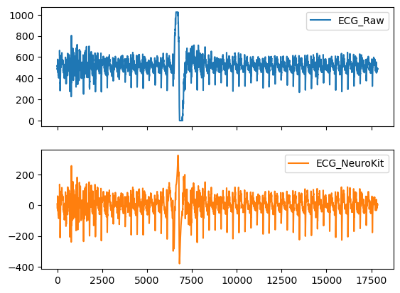

# **LABORATORIO 10: PROCESAMIENTO DE SEÑAL ECG**
# **Tabla de contenidos**

1. [Introducción](#id1)
2. [Objetivos](#id2)
3. [Materiales y equipos](#id3)
4. [Métodología](#id4)
5. [Resultados](#id5)
6. [Conclusiones](#id6)
7. [Referencias bibliográficas](#id7)

## **Introducción** 
  
## **Objetivos** 
* Filtrar, procesar y analizar la señal ECG usando la librería Neurokit2
* Extraer y evaluar características importantes de las señales ECG
* Identificar los picos R y hallar el HRV (variabilidad de la frecuencia cardiaca)

## **Materiales y equipos** 

   
|  **Modelo**  | **Descripción** | **Cantidad** |
|:------------:|:---------------:|:------------:|
|       -      |      Laptop     |       1      |
| - |   Python y librerías (Neurokit2)  |       -      |
| - |   Visual Studio Code  |       -      |

 Tabla 1: Materiales y equipos</i>

## **Metodología** 
Para el procesamiento de señales de ECG, se utilizó la librería neurokit2 en Python, con un flujo de trabajo estructurado en varias etapas que incluye la limpieza, el pre-procesamiento y el análisis de las señales. Para ello, se analizaron la primera derivación de 3 señales ECG obtenidas en laboratorios anteriores
- Señal ECG en reposo
- Señal ECG obtenida mientas la persona mantiene la respiración por 10 segundos
- Señal ECG después de realizar una actividad física

A continuación, se describe cada paso seguido en este proceso, detallando las funciones empleadas y su propósito.

**1. Carga y Preprocesamiento de la Señal**\
Inicialmente, se procedió a cargar las señales de ECG a procesar. En esta etapa, se buscó garantizar la calidad de las señales mediante el preprocesamiento para reducir artefactos y ruido, facilitando la identificación de eventos relevantes en la señal.

**2. Limpieza de la Señal con ecg_clean**\
La primera función aplicada fue **ecg_clean**, diseñada específicamente para filtrar y mejorar la calidad de las señales de ECG mediante algoritmos de limpieza. Esta función elimina el ruido y los artefactos comunes en las señales de ECG, como los artefactos por movimiento o el ruido de la línea de base, que podrían afectar la detección precisa de los picos R y otros eventos. La función admite varios tipos de filtros (por ejemplo, Butterworth y Wavelet), y la elección se ajustó para maximizar la calidad de la señal dependiendo de las características específicas de la señal. En este laboratorio se utilizó el **método neurokit el cual consiste en un filtro Butterworth paso alto de 0,5 Hz (orden = 5), seguido de filtrado de línea eléctrica**. 

**3. Procesamiento Completo de la Señal con ecg_process**\
La función **ecg_process** se utilizó a continuación para realizar el procesamiento completo de la señal de ECG. Esta función integra varios pasos, como la detección de picos y la extracción de características, permitiendo realizar un análisis en profundidad de la señal. ecg_process realiza una detección automática de los picos R y calcula intervalos como el RR, fundamentales para analizar el ritmo cardíaco y otras características fisiológicas. Esta función permitió obtener características como: ECG_Quality, ECG_R_Peaks, ECG_P_Peaks, ECG_Q_Peaks, ECG_S_Peaks, ECG_T_Peaks.

**4. Identificación de los Picos R con ecg_peaks**\
La función ecg_peaks se aplicó a la señal procesada para identificar los picos R, que son los puntos más prominentes en una señal de ECG y corresponden a la despolarización ventricular. Los picos R son cruciales en el análisis de ECG porque se utilizan para calcular la frecuencia cardíaca y variabilidad del ritmo cardíaco (HRV). Se utilizó el método neurokit donde los complejos QRS se detectan en función de la pendiente del gradiente absoluto de la señal del ECG. Posteriormente, los picos R se detectan como máximos locales en los complejos QRS.

**5. Análisis de la Señal con ecg_analyze**\
Con los picos R identificados, se utilizó la función ecg_analyze para llevar a cabo un análisis completo de la señal de ECG. Esta función permite obtener parámetros y métricas relevantes, como la frecuencia cardíaca media, la desviación estándar de los intervalos RR (HRV - Heart rate variability)

**6. Visualización de la Señal con ecg_plot**\
Finalmente, se empleó la función ecg_plot para visualizar las señales de ECG y los eventos detectados. Esta función permite graficar la señal en el tiempo y resaltar los picos R, proporcionando una representación gráfica de los datos procesados, lo cual facilita la verificación visual del procesamiento y la limpieza de la señal. Además, de ploteo la señales ECG en papel para electrocardiograma

## **Resultados** 
**Reposo (Derivación Bipolar I)**
  - **Pre-procesamiento de la señal: ecg_clean()**  

Figura 1: Filtrado de la señal ECG en reposo usando la función ecg_clean()</i>

  - **Análisis**\
    a. ecg_process()
    

    

    
Figura 2: Análisis de la señal ECG en reposo usando la función ecg_process()</i>

    

  
    b. ecg_analyze()
    

       
    |  **Característica**  | Valor |
    |:------------:|:---------------:|
    |       ECG_Rate Mean (bpm)  |      49.57   | 
    | HRV_MeanNN |  1409.88 ms | 
    | HRV_SDNN |   672.76 ms |
    
 Tabla 2: Obtención del HRV</i>

    
    

    c. Identificación de picos R
    

    

    
Figura 3: Identifiación de picos R en reposo usando la función ecg_peaks()</i>

    

  - **Ploteo de la señal ECG usando ecg_plot()**
    

    

    
Figura 4: Ploeto de la señal ECG en reposo usando la función ecg_plot()</i>

    

    

    

    
Figura 5: Señal ECG en papel para electrocardiagrama</i>

    

**Manteniendo la respiración por 10 segundos (Derivación Bipolar I)**
  - **Pre-procesamiento de la señal: ecg_clean()**

Figura 6: Filtrado de la señal ECG mientras se mantiene la respiración usando la función ecg_clean()</i>

    
- **Análisis**\
    a. ecg_process()
    

    

    
Figura 7:Análisis de la señal ECG mientras se mantiene la respiración usando la función ecg_process()</i>

    

  
    b. ecg_analyze()
    

       
    |  **Característica**  | Valor |
    |:------------:|:---------------:|
    |       ECG_Rate Mean (bpm)  |      41.98   | 
    | HRV_MeanNN |  1581.29 ms | 
    | HRV_SDNN |   781.31 ms |
    
 Tabla 3: Obtención del HRV</i>

    
    

  
    c. Identificación de picos R
    

    

    
Figura 8: Identifiación de picos R de la señal ECG mientras se mantiene la respiración usando la función ecg_peaks()</i>

    

- **Ploteo de la señal ECG usando ecg_plot()**
    

    

    
Figura 9: Ploteo señal ECG mientras se mantiene la respiración usando la función ecg_plot()</i>

    

    

    

    
Figura 10: Señal ECG en papel para electrocardiagrama</i>

    

**Después de una actividad física (Derivación Bipolar I)**
  - **Pre-procesamiento de la señal: ecg_clean()**

Figura 11: Filtrado de la señal ECG después de una actividad física usando la función ecg_clean()</i>

    
- **Análisis**\
    a. ecg_process()
    

    

    
Figura 12: Filtrado de la señal ECG después de una actividad física usando la función ecg_process()</i>

    

  
    b. ecg_analyze()
    

       
    |  **Característica**  | Valor |
    |:------------:|:---------------:|
    |       ECG_Rate Mean (bpm)  |      62.44   | 
    | HRV_MeanNN |  989.31 ms | 
    | HRV_SDNN |  358.57 ms |
    
 Tabla 4:Obtención del HRV</i>

    
    

    c. Identificación de picos R
    

    

    
Figura 13: Identifiación de picos de la señal ECG después de una actividad física usando la función ecg_peaks()</i>

    

- **Ploteo de la señal ECG usando ecg_plot()**
     

    

    
Figura 14: Ploteo señal ECG después de una actividad física usando la función ecg_plot()</i>

    

    
    

    

    
Figura 15: Señal ECG en papel para electrocardiagrama</i>

    

## **Discusión**
- La frecuencia cardiaca fue similar en reposo y luego de sostener la respiración por 10 segundos, pero varió significativamente al realizar un ejercicio.
- La HRV MeanNN y SDNN son mayores en reposo y al contener la respiración por 10s, y menores después del ejercicio. Esto sugiere que la actividad física disminuye la variabilidad de la frecuencia cardíaca y a su vez disminuye el periodo entree picos al ser la respiración más apresurado
- La función ecg_plot facilitó la visualización, haciendo posible el análisis de cambios en la morfología de las ondas bajo diferentes condiciones.
## **Conclusiones** <a name="id6">
   - 
   - 
   - 

## **Archivos** 
- [Documentos (.txt)](https://github.com/DianaCortezL/ISB-Grupo-5/tree/7c6ef550649274b69b6c0ab7dcd442e831e8bcb9/Otros/Archivos_varios/Lab5_ECG)
- [Procesamiento ECG (Reposo)](https://github.com/DianaCortezL/ISB-Grupo-5/blob/61c077b132e80fc61da74c910ea39de3dd4c005c/ISB/Laboratorios/Lab10%20-%20Procesamiento%20de%20ECG/nuevodelnuevo.ipynb)
- [Procesamiento ECG (Manteniendo respiración)](https://github.com/DianaCortezL/ISB-Grupo-5/blob/61c077b132e80fc61da74c910ea39de3dd4c005c/ISB/Laboratorios/Lab10%20-%20Procesamiento%20de%20ECG/ManteniedoRespiracionD1.ipynb)
- [Procesamiento ECG (Después de ejercicio)](https://github.com/DianaCortezL/ISB-Grupo-5/blob/61c077b132e80fc61da74c910ea39de3dd4c005c/ISB/Laboratorios/Lab10%20-%20Procesamiento%20de%20ECG/EjercicioD1.ipynb)

## **Referencias bibliográficas** 
[1] 

[2] 
 
[3] 

[4]
