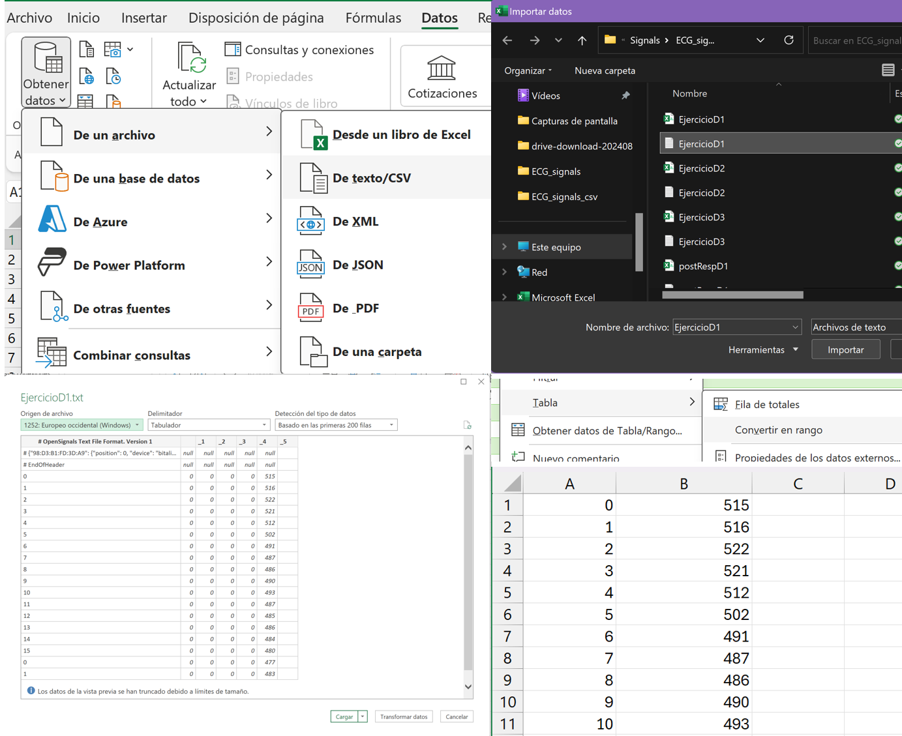
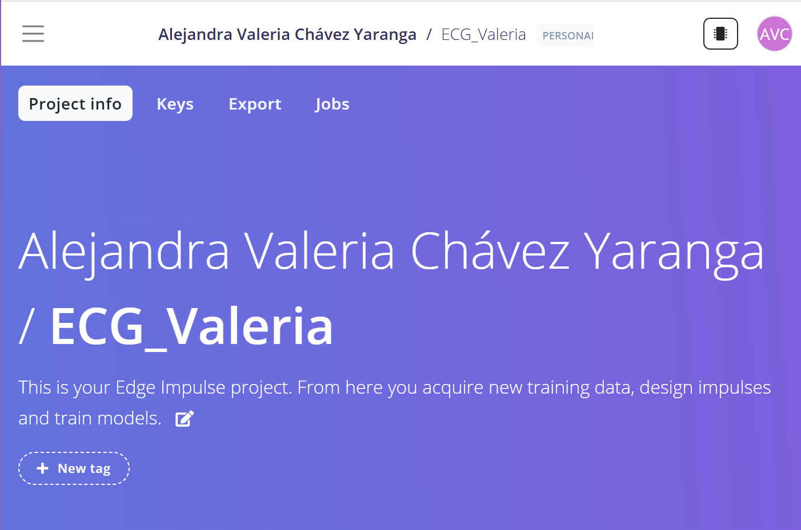
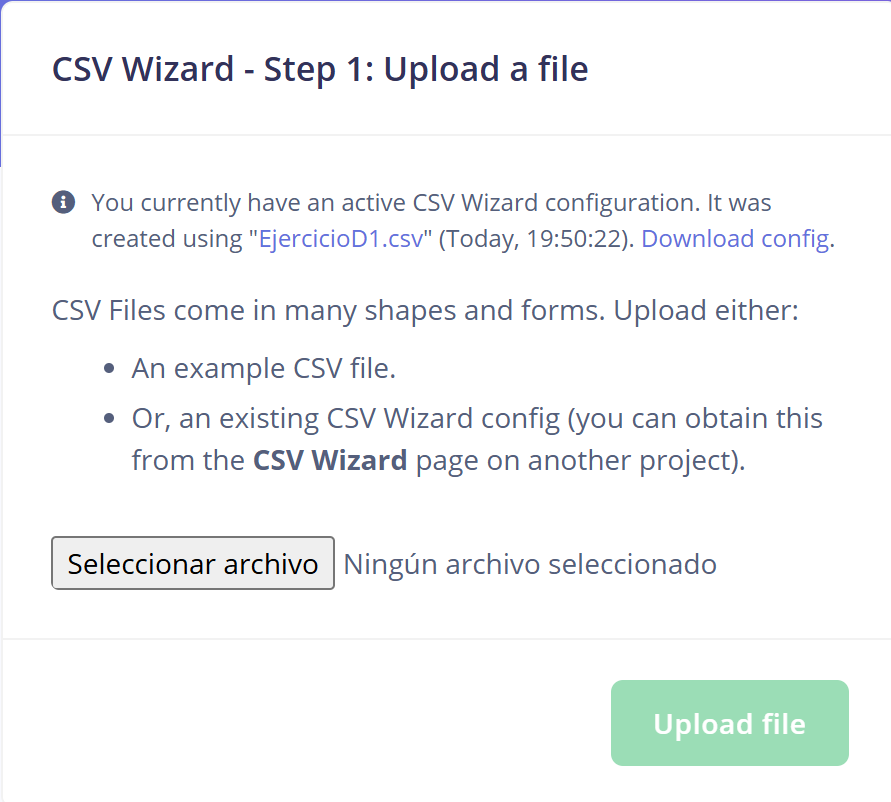
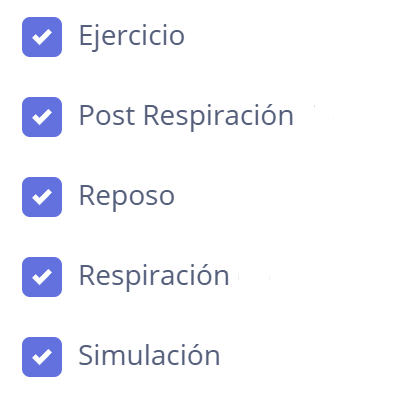
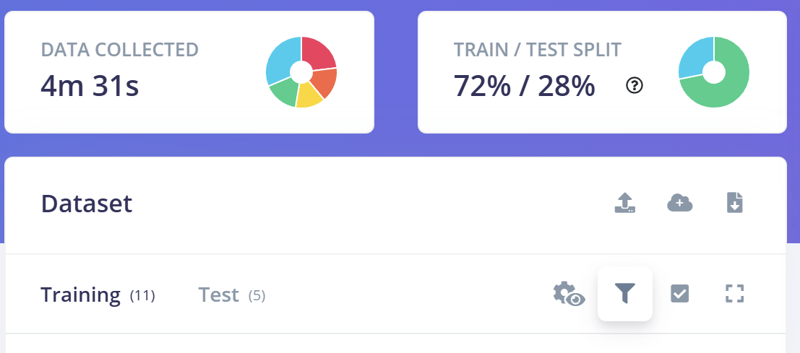
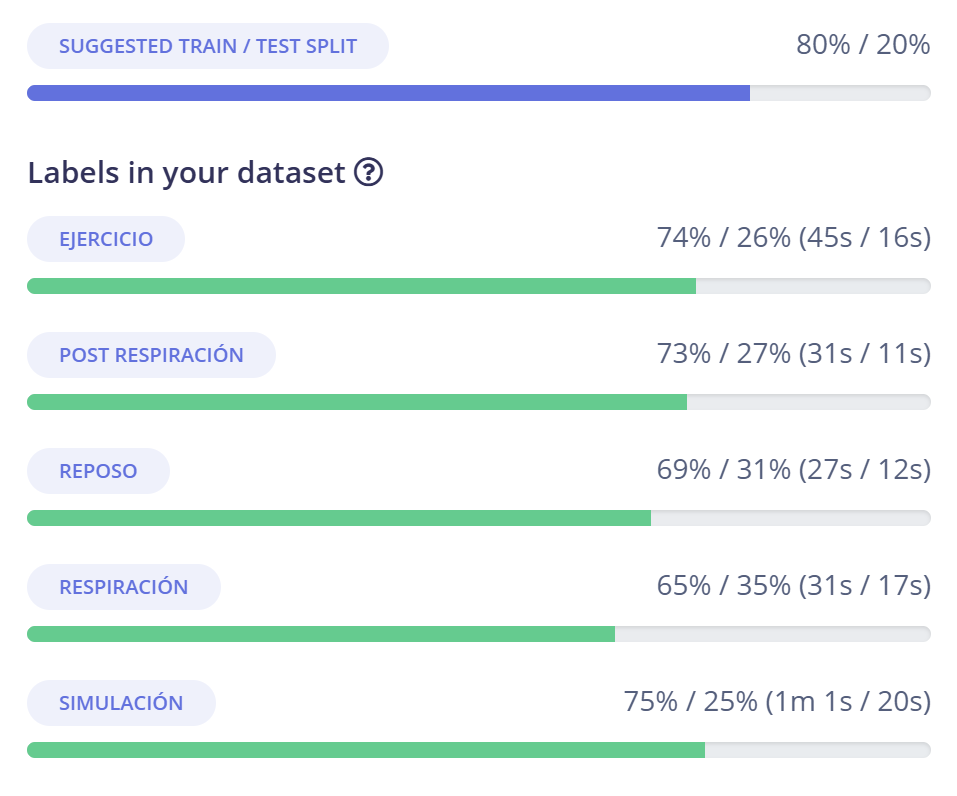
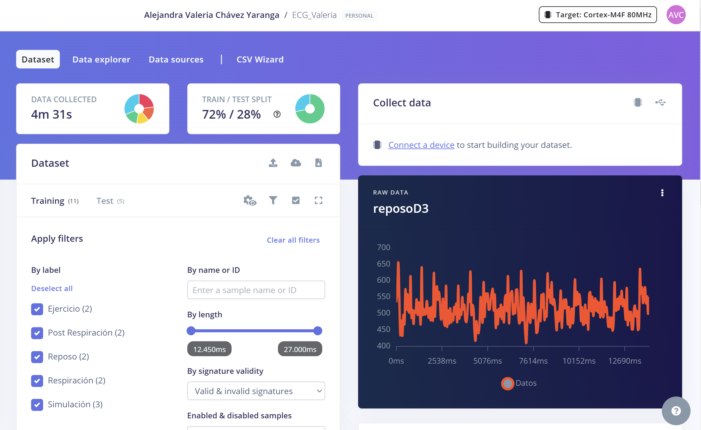

# **LABORATORIO 11: EDGE IMPULSE - DATA ECG**

Link del proyecto de Edge Impulse: https://studio.edgeimpulse.com/public/560503/live

## **Introducción** 
Edge Impulse es una plataforma para desarrollar algoritmos de aprendizaje automático de manera rápida y sencilla. Es muy intuitiva y fácil de usar, que permite subir archivos directamente desde tus datos.

## **Metodología** 
En este laboratorio, se trabajó con datos previamente obtenidos en el laboratorio de adquisición de señales ECG. Estos datos fueron convertidos al formato CSV, para posteriormente ser subidos a la plataforma Edge Impulse.

En Edge Impulse, los datos se utilizaron tanto para el entrenamiento como para la evaluación del modelo. Se definieron cinco etiquetas para clasificar los estados en las señales de ECG:
- Ejercicio
- Post respiración
- Reposo
- Respiración
- Simulación

## **Conversión de .txt a .csv** 
Para subir los datos a Edge Impulse, primero fue necesario convertirlos del formato .txt a .csv. Este proceso se realizó utilizando Excel:
- En la pestaña Datos, se seleccionó la opción Obtener datos > Desde un archivo > Desde texto/CSV.
- Al importar los datos, Excel los convirtió automáticamente en una tabla dinámica. Para trabajar con una tabla normal, esta se transformó (Tabla > Convertir en rango).
- Se eliminaron las columnas o filas innecesarias para limpiar el dataset y asegurarse de que solo esté la información necesaria.
- Finalmente, el archivo se guardó en formato .csv
Con esto ya se pudieron subir los datos a Edge Impulse.

<div align="center">

  
*Figura 1: Proceso de conversión de .txt a .csv*

</div>

## **EDGE IMPULSE** 

1. Para iniciar se creó un nuevo proyecto en Edge Impulse 

<div align="center">

  
*Figura 2: Creación del proyecto en Edge Impulse*

</div>

2. Para comenzar con la carga de los datos, se configuró el CSV Wizard, una herramienta utilizada para importar archivos CSV y definir cómo se deben procesar los datos que van a ser subidos.

<div align="center">

  
*Figura 3: Creación del CSV WIZARD*

</div>

La configuración fue la siguiente: 
```python
{
    "version": 1,
    "fileName": "EjercicioD1.csv",
    "created": 1731891022978,
    "delimiter": ";",
    "skipFirstLines": 0,
    "fixedHeader": [
        "Num",
        "Datos"
    ],
    "spec": {
        "type": "timeseries-row",
        "valueColumns": [
            "Datos"
        ],
        "timestamp": {
            "type": "fixed-frequency",
            "frequency": 1000
        }
    }
}
```
3. Al configurar el CSV WIZARD, ya se puede empezar con la carga de archivos. Lo que se hizo fue dividir los archivos en diferentes etiquetas: Ejercicio, Post respiración, Reposo, Respiración y Simulación. 

<div align="center">

  
*Figura 4: Etiquetas utilizadas*

</div>

4. Se realizó la carga de datos para entrenamiento y prueba. Se subieron un total de 11 archivos para entrenamiento y 5 archivos para prueba, logrando una división del 72%/28% en el dataset. Aunque Edge Impulse recomienda una proporción aproximada de 80/20, la proporción alcanzada es adecuada y equilibrada para este modelo.

<div align="center">

  
*Figura 5: Resumen de datos recopilados y división del dataset*

</div>

<div align="center">

  
*Figura 6: Distribución de datos por etiquetas*

</div>


<div align="center">

  
*Figura 7: Modelo final*

</div>