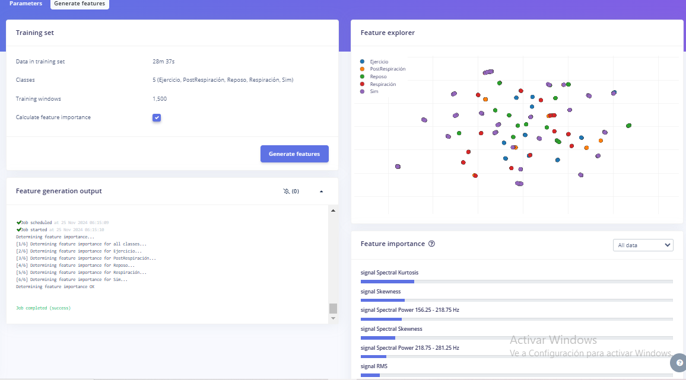

# **LABORATORIO 12: EDGE IMPULSE  - IMPULSE DESIGN**
Nombre: Jorge Guillermo Chavez Echajaya\
Código: 72215542\
Link del proyecto de Edge Impulse: https://studio.edgeimpulse.com/public/558234/live

## **Metodología** 
Este proyecto se centró en crear un impulse design en Edge Impulse, utilizando varios pasos para desarrollar un modelo que clasifique de manera efectiva datos sensoriales.

*Figura 1: Base de datos*

*1. Creación del Impulse*

La primera fase consistió en definir la estructura básica del impulse en Edge Impulse. Se configuraron los parámetros para la segmentación de la señal (tamaño y desplazamiento de la ventana) y se añadieron dos bloques fundamentales: uno de análisis espectral y otro para clasificación. Esta estructura tiene como objetivo preparar los datos para que puedan ser utilizados en el proceso de aprendizaje.

*Figura 2: Setup de Create Impulse*

*2. Extracción de Características Espectrales*

Después, se realizó la configuración del análisis espectral. Este análisis se aplica para descomponer las señales en componentes que describen su comportamiento en el dominio de la frecuencia. Se utilizó una Transformada Rápida de Fourier (FFT), se habilitó el logaritmo del espectro y se superpusieron marcos FFT para obtener una mejor resolución de las características. La previsualización mostró que las características extraídas representaban adecuadamente las propiedades clave de las señales estudiadas.

*Figura 3: Parametros de la data*

*Figura 4: Entrenamiento de los datos*

*3. Configuración del Clasificador*

Posterior a ello se entrena un modelo de clasificación para identificar las categorías definidas: EJERCICIO, POST RESPIRACIÓN, REPOSO, RESPIRACIÓN y SIMULADOR. El bloque de clasificación se diseñó para analizar las características espectrales generadas y así asignar una etiqueta a cada segmento de datos. Se evaluaron diferentes configuraciones hasta lograr una estructura con un rendimiento razonable.

*Figura 5: Setup del Classifier*

*4. Reentrenamiento y Optimización del Modelo*

Tras el primer entrenamiento, se revisaron las métricas para evaluar la efectividad del modelo. Entre estas métricas se encontraban la precisión y la matriz de confusión, las cuales ayudaron a identificar los puntos débiles en el desempeño. Si los resultados eran insatisfactorios, se hicieron ajustes en los parámetros del impulse y se recopilaron más datos para mejorar el balance entre clases y así optimizar la capacidad del modelo.

*Figura 6: Accuracy del modelo*

*Figura 7: Performance del modelo*

**Resultados y Análisis**

El modelo obtuvo un 73.5% de precisión en la validación, lo que representa un desempeño moderado. Se detectaron dificultades para diferenciar entre las clases de reposo y respiración, mostrando un alto nivel de confusión entre estas categorías.

Posibles causas potenciales de esta confusión incluyen:

* Las características entre las clases de reposo y respiración resultan bastante similares, lo que dificulta la clasificación.

* La cantidad de datos disponible para entrenar estas clases no fue suficiente o no fue representativa.

* Es posible que algunos parámetros de configuración no estuvieran optimizados para maximizar la diferenciación entre las clases.

**Recomendaciones**

* Incrementar la cantidad de datos recolectados, especialmente en las clases de reposo y respiración, para proporcionar al modelo más ejemplos que representen su variabilidad.

* Asegurar un balance adecuado en el conjunto de datos para evitar que el modelo presente sesgos hacia clases más representadas.

* Revisar y ajustar los parámetros de análisis espectral y del clasificador para mejorar la capacidad de diferenciación entre categorías similares.
