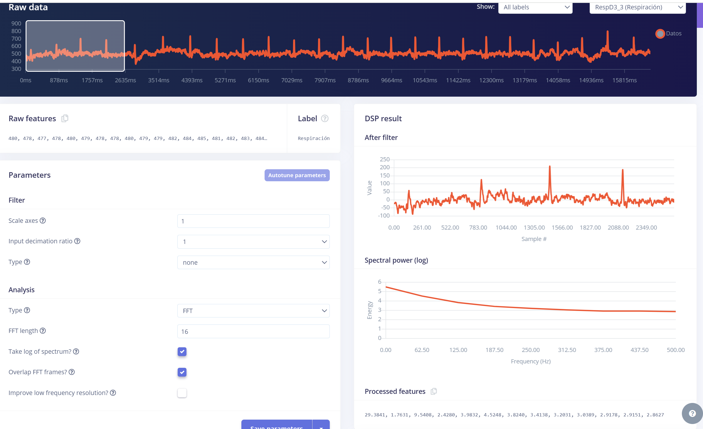
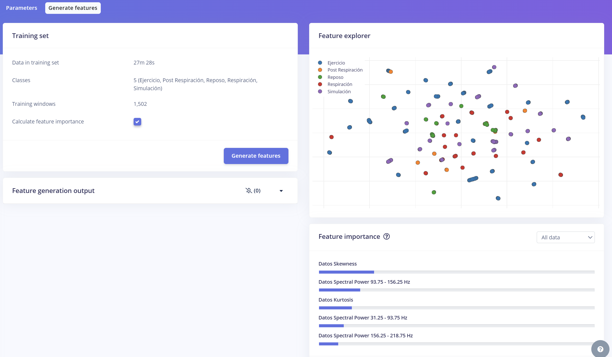
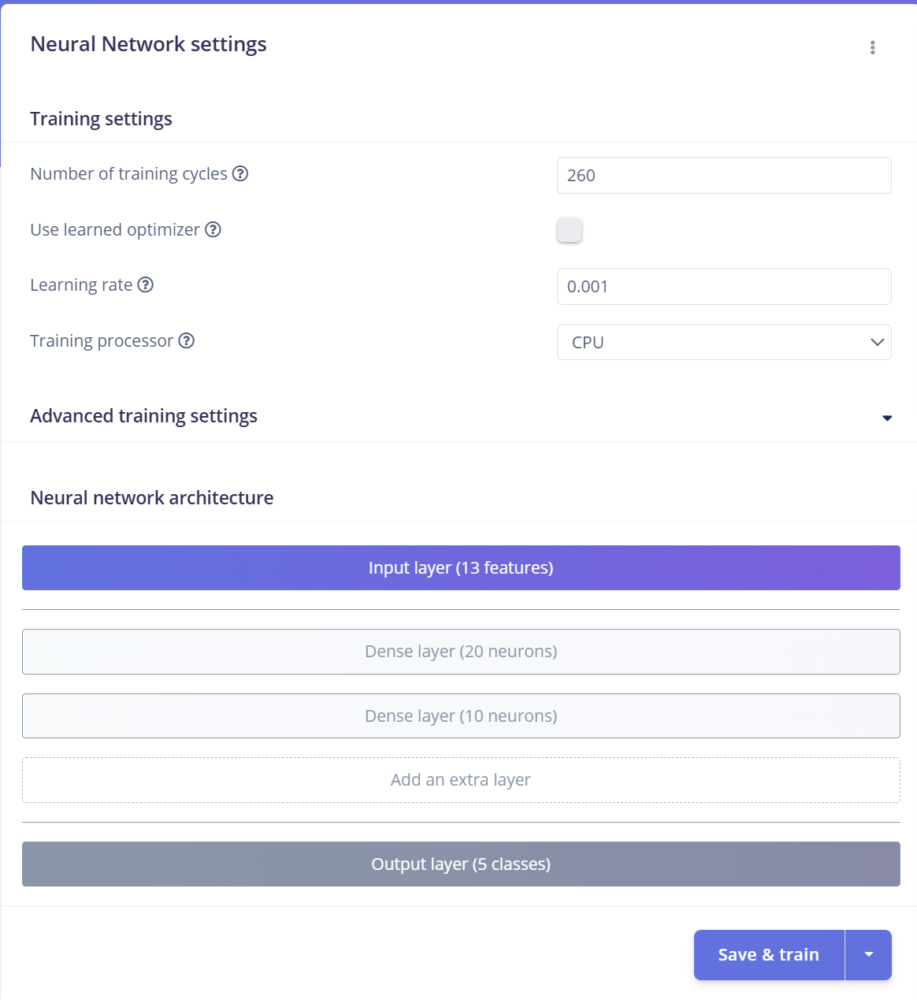
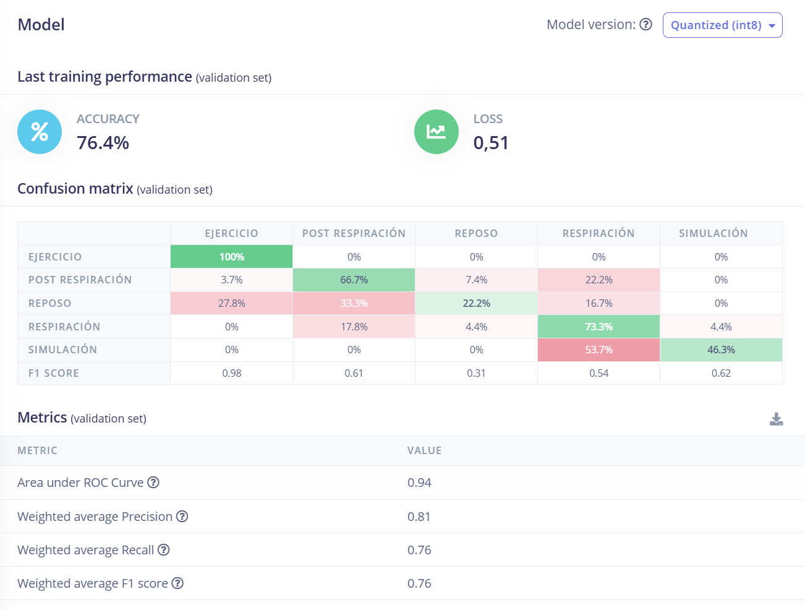

# **LABORATORIO 12: EDGE IMPULSE - IMPULSE DESIGN**
Nombre: Alejandra Valeria Chávez Yaranga\
Código: 72754108\
Link del proyecto de Edge Impulse: https://studio.edgeimpulse.com/public/560503/live

## **Metodología** 
En este laboratorio, el objetivo fue construir un modelo de aprendizaje automático para clasificar diferentes etiquetas relacionadas con datos fisiológicos y de simulación. Las etiquetas consideradas fueron: Ejercicio, Post Respiración, Reposo, Respiración, y Simulación.

## **DATASET** 
El dataset final incluyó 68 muestras de entrenamiento y 17 muestras de prueba, distribuidas de manera equitativa entre las etiquetas disponibles. Teniendo un ratio 81%/19% en train/test.

  
*Figura 1: Dataset*

## **Creación de Impulse** 

El Impulse fue creado utilizando un flujo compuesto por un bloque de procesamiento (Spectral Analysis) y un bloque de aprendizaje (Classification). 

Se configuró una ventana de entrada de 2609 ms y una frecuencia de muestreo de 1000 Hz, habilitando además el zero-pad para asegurar la consistencia en las ventanas incompletas. 

  
*Figura 2: Creación del Impulse*

## **Spectral Features** 

Se trabajó con dos secciones principales: Parameters y Generate Features, las cuales permitieron configurar el procesamiento de los datos y extraer características relevantes para el modelo.

1. Parameters: Se utilizó la transformada rápida de fourier (FFT) con una longitud de ventana de 16 muestras con las opciones de  tomar el logaritmo del espectro y de la superposición de ventanas habilitadas.

  
*Figura 3: Parameters de Spectral features*

2. Generate features: En esta pestaña, se generaron y analizaron las características extraídas de todo el conjunto de datos de entrenamiento. Los datos procesados cubrieron un total de 27m 28s, distribuidos en 1502 ventanas de entrenamiento, abarcando las cinco clases (Ejercicio, Post Respiración, Reposo, Respiración y Simulación).

  
*Figura 4: General features de Spectral features*

## **Classifier** 

El modelo fue entrenado para clasificar los datos en las cinco categorías: Ejercicio, Post Respiración, Reposo, Respiración, y Simulación. 

El entrenamiento se realizó en 260 ciclos, que representan el número de iteraciones completas en las que el modelo procesa el conjunto de datos de entrenamiento para ajustar y minimizar el error. 

  
*Figura 5: Configuración de red neuronal*

Durante el entrenamiento, el modelo alcanzó una precisión del 76.4% en el conjunto de validación. 

Se identificar patrones específicos en las señales, aunque algunas clases como Reposo y Post Respiración presentaron confusiones debido a su similitud en las características extraídas. 

La matriz de confusión refleja estas dificultades, mostrando un rendimiento perfecto para la clase Ejercicio, pero confusiones notables entre otras clases.

  
*Figura 6: Modelo:  Precisión y Matriz de confusión*

  
*Figura 7: Data explorer*

## **Conclusiones y recomendaciones** 

### **Conclusiones**

1. El modelo alcanzó una precisión del 76.4%, con un desempeño notable en la clasificación de la clase Ejercicio (100%) y menor precisión en clases como Reposo y Post Respiración debido a posibles similitudes en sus características espectrales.

2.  A pesar de su eficiencia, el modelo presenta dificultades al clasificar ciertas etiquetas, lo que puede ser atribuido a un posible desbalance en los datos o una insuficiencia en el volumen de datos de entrenamiento para algunas clases.

### **Recomendaciones**
1. Recolectar más datos, especialmente para las clases con menor precisión, como Reposo y Post Respiración, para mejorar la capacidad de generalización del modelo.
2. Incrementar el número de ciclos de entrenamiento para permitir un mayor ajuste.
3. Experimentar con otros tipos de procesamiento de datos, como filtros adicionales o ajustes en la longitud de la Transformada Rápida de Fourier (FFT), para optimizar las características extraídas.